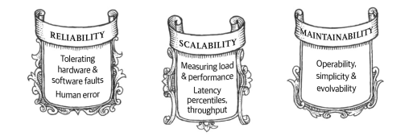
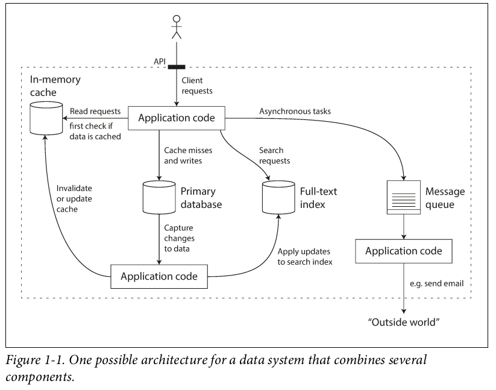
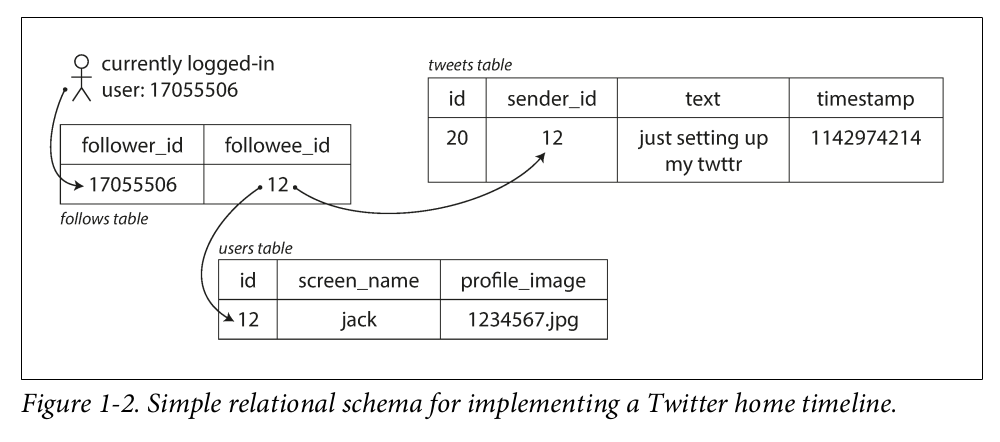
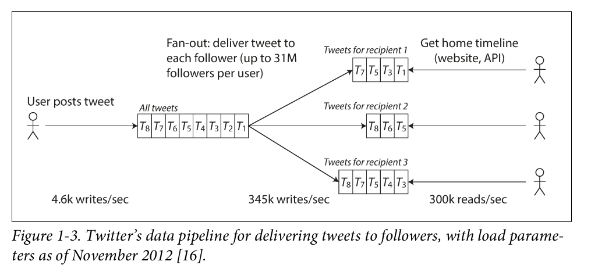
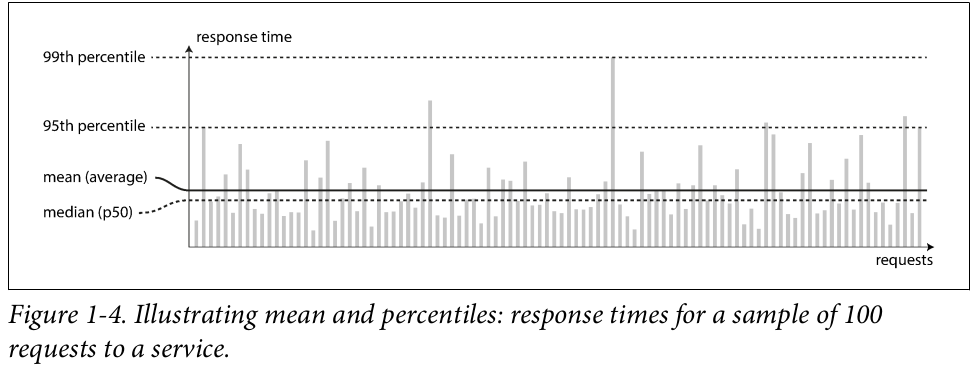
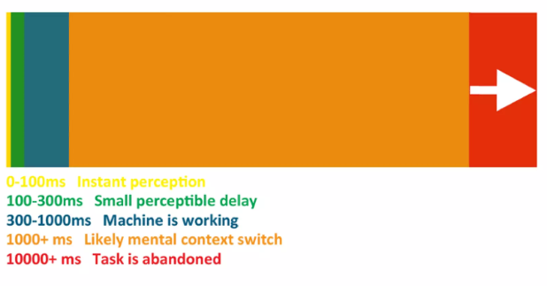
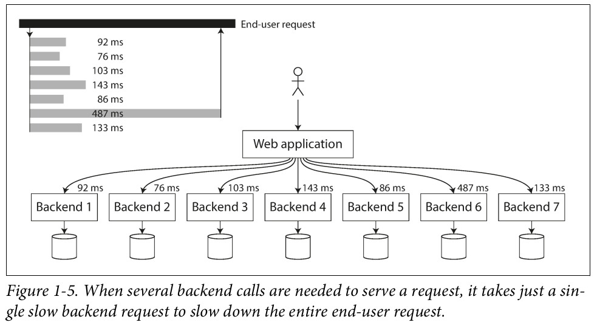

# The Three Pillars of the Book



# Reliable, Scalable, and Maintainable Applications

Applications nowadays are data-intensive, as opposed to compute-intensive. Nowadays bigger problems take more time to consider, such as:

- the amount of data
- the complexity of data
- the speed at which it is changing

A data-intensive application is typically built in a way to provide commonly needed functionality. For example, many applications need to:

- Store data (Databases)
- Remember the result of an expensive operation, thus speeding up reads (cache)
- Allow users to search data by keyword or filter it in various ways (search indexes)
- Send a message to another process, to be handled asynchronously (stream processing)
- Periodically crunch a large amount of accumulated data (batch processing)

When building an application, we still need to figure out which tools and which approaches are the most appropriate for the task at hand. And it can be hard to combine tools when you need to do something that a single tool cannot do alone.

This chapter focuses on exploring fundamentals of achieving reliable, scalable and maintainable data systems. We will explore what different tools have in common, what distinguishes them, and how they achieve their characteristics.

## Thinking About Data Systems

We typically think of databases, queues, caches, etc. as being very different categories of tools. Although a database and a message queue have some superficial similarity—both store data for some time—they have very different access patterns, which means different performance characteristics, and thus very different implementations.

**So why should we lump them all together under an umbrella term like *data systems*?**

Nowadays, any new tools for data storage and processing are optimized for a variety of different use cases, and they no longer neatly fit into traditional categories. There are datastore's that are also used as message queues (Redis), and there are message queues with database-like durability guarantees (Apache Kafka). **The boundaries between the categories are becoming blurred.**

Increasingly many applications now have such demanding or wide-ranging requirements that **a single tool can no longer meet all of its data processing and storage needs**.

For example, if you have an application-managed caching layer (using Memcached or similar), or a full-text search server (such as Elasticsearch or Solr) separate from your main database, it is normally the application code’s responsibility to keep those caches and indexes in sync with the main database.



If you are designing a data system or service, a lot of tricky questions arise.

- How do you **ensure that the data remains correct and complete**, even when things go wrong internally?
- How do you **provide consistently good performance to clients**, even when parts of your system are degraded?
- How do you **scale** to handle an increase in load?
- What does a good API for the service look like?

We focus on three concerns that are important in **most** software systems:

*Reliability*

- The system should continue to work *correctly* (performing the correct function at the desired level of performance) even in the face of *adversity* (hardware or software faults, and even human error).

*Scalability*

- As the system grows (in data volume, traffic volume, or complexity), there should be reasonable ways of dealing with that growth

*Maintainability*

- Over time, many different people will work on the system (engineering and operations, both maintaining current behavior and adapting the system to new use cases), and they should all be able to work on it *productively*.

## Reliability

Considering the scope of software development, typical definitions include:
• The application performs the function that the user expected.
• It can tolerate the user making mistakes or using the software in unexpected ways.
• Its performance is good enough for the required use case, under the expected load and data volume.
• The system prevents any unauthorized access and abuse.

If all those things together mean “working correctly,” then we can understand reliability as meaning, roughly, **“continuing to work correctly, even when things go wrong.”**

The things that can go wrong are called faults, and systems that anticipate faults and can cope with them are called fault-tolerant or resilient. Of course, it only makes sense to talk about tolerating certain types of faults. Note that **a fault is not the same as a failure.**

- A fault is usually defined as **one component** of the system deviating from its spec
- A failure is when the **system as a whole** stops providing the required service to the user.

Counterintuitively, in such fault-tolerant systems, it can make sense to increase the rate of faults by triggering them deliberately—for example, by randomly killing individual processes without warning. By intentionally creating faults in a controlled manner, teams can verify that their fault-tolerance mechanisms actually work and identify potential weaknesses before they cause real system failures.

Although we generally prefer tolerating faults over preventing faults, there are cases where prevention is better than cure (e.g., because no cure exists). This is the case with security matters. That event cannot be undone. However, the scope here is to deal with types of faults that can be cured.

### Hardware Faults

It is one of the most common causes of faults.

- Hard disks crash
- RAM becomes faulty
- The power grid has a blackout
- Someone unplugs the wrong network cable.

Some solutions widely used are:

- add redundancy to the individual hardware components in order to reduce the failure rate of the system.
- Disks may be set up in a RAID configuration
- Servers may have dual power supplies and hot-swappable CPUs,
- Datacenters may have batteries and generators for backup power.

Hardware redundancy was traditionally sufficient for most applications since machine failures were rare and backups could be quickly restored. However, two factors have changed this landscape:

1. The increasing scale of applications means more machines are needed, leading to a higher probability of hardware faults
2. Cloud platforms like AWS prioritize flexibility over individual machine reliability, making instance unavailability more common

Systems are now being designed to handle entire machine failures through software fault-tolerance rather than just hardware redundancy. This approach offers better operational flexibility - while a single-server system needs complete downtime for updates, a fault-tolerant system can be updated gradually, one node at a time, without system interruption.

### Software Errors

- A **software bug** that causes every instance of an application server to crash when given a particular bad input.
- A **runaway process** that uses up some shared resource—CPU time, memory, disk space, or network bandwidth.
- A **service** that the system depends on that slows down, **becomes unresponsive**, or starts returning corrupted responses.
- **Cascading failures**, where a small fault in one component triggers a fault in another component, which in turn triggers further faults.

Systematic software faults have no simple fix, but several practices help: 

- careful design
- testing
- process isolation
- crash recovery
- production monitoring.

Systems can also implement **self-checking** **mechanisms** to verify guarantees and alert on discrepancies, such as message queue input/output matching.

### Human Errors

One study of large internet services found that configuration errors by operators were the **leading cause of outages**, whereas hardware faults (servers or network) played a role in only 10–25% of outages.

How do we make our systems reliable, in spite of unreliable humans? The best systems combine several approaches:

1. Design systems that minimize error opportunities through well-designed interfaces and APIs
2. Create separate sandbox environments for safe experimentation with real data
3. Implement comprehensive testing at all levels (unit, integration and manual tests)
4. Enable quick recovery from errors through features like rollbacks and gradual code deployment
5. Set up detailed monitoring and telemetry systems
6. Maintain good management practices and training

This is particularly important since human errors, especially configuration mistakes, are the leading cause of system outages

### How Important is Reliability?

Reliability is not just for nuclear power stations and air traffic control software—more mundane applications are also expected to work reliably.

- Business application bugs can lead to lost productivity and legal risks
- Even "non-critical" applications need reliability - for example, a photo application storing irreplaceable family memories
- While reliability can sometimes be traded off to reduce costs (like in prototypes or low-margin services), such decisions should be made consciously

## Scalability

Even if a system is working reliably today, that doesn’t mean it will necessarily work reliably in the future. One common reason for degradation is increased load: perhaps the system has grown from 10,000 concurrent users to 100,000 concurrent users, or from 1 million to 10 million. Perhaps it is processing much larger volumes of data than it did before.

**Scalability is the term we use to describe a system’s ability to cope with increased load.**

Discussing scalability means considering questions like:

- If the system grows in a particular way, what are our options for coping with the growth?
- How can we add computing resources to handle the additional load?

### Describing Load

First, we need to succinctly describe the current load on the system; only then can we discuss growth questions (what happens if our load doubles?). Load can be described with a few numbers which we call **load parameters.**

To choose the best parameters for your system, consider the architecture. This could involve:

- requests per second to a web server
- read/write ratios in a database
- active users in a chat room
- cache hit rates

Focus on either the average case or the few extreme cases that create bottlenecks.

### Twitter: a use case example

Two of Twitter’s main operations are:

*Post tweet*

A user can publish a new message to their followers (4.6k requests/sec on average, over 12k requests/sec at peak).

*Home timeline*
    A user can view tweets posted by the people they follow (300k requests/sec).

Twitter’s scaling challenge is not primarily due to tweet volume, but due to fan-out. Each user follows many people, and each user is followed by many people. There are broadly two ways of implementing these two operations:

1. Posting a tweet simply inserts the new tweet into a global collection of tweets. When a user requests their home timeline, look up all the people they follow, find all the tweets for each of those users, and merge them (sorted by time). In a relational database, you could write a query such as:

```sql
SELECT tweets.*, users.* FROM tweets
JOIN users ON tweets.sender_id = users.id
JOIN follows ON follows.followee_id = users.id
WHERE follows.follower_id = current_user
```



1. This approach uses a cache-first strategy for faster timeline reads. Here's how it works:
- Each user has a dedicated cache that stores their personalized timeline
- When someone tweets, the system:
    - Identifies all their followers
    - Adds the new tweet to each follower's cached timeline

This method makes reading timelines very efficient since the content is pre-computed and stored, though it requires more work during the posting process.



Twitter's evolution in handling tweet delivery illustrates an important scalability decision:

- Initially used Approach 1: querying tweets on-demand when users checked their timeline, but this couldn't handle the load efficiently
- Switched to Approach 2: pre-computing timelines, which works better because:
    - Tweet publishing (4.6k/sec) happens much less frequently than timeline reads
    - However, each tweet requires multiple writes (avg. 75 followers per tweet)
    - Some popular accounts have 30M+ followers, making single tweets extremely resource-intensive

The challenge is delivering tweets to all followers within Twitter's 5-second target, especially given that 4.6k tweets/sec can result in 345k writes/sec to timeline caches.

For Twitter, the key load parameter is the **distribution of followers per user** and their **tweet frequency**, as this determines the fan-out workload. While different applications will have their own characteristics, similar analysis can be applied.

Twitter now uses a hybrid approach: regular users' tweets are fanned out immediately to followers' timelines, while tweets from users with very large followings are fetched and merged at read time. This combination provides optimal performance.

### Describing Performance

Once you have described the load on your system, you can investigate what happens when the load increases. You can look at it in two ways:

- When you increase a load parameter and keep the system resources (CPU, mem‐
ory, network bandwidth, etc.) unchanged, how is the performance of your system
affected?
- When you increase a load parameter, how much do you need to increase the
resources if you want to keep performance unchanged?

**Both questions require performance numbers**, so let’s look briefly at describing the performance of a system.
**In a batch processing system such as Hadoop, we usually care about** **throughput**—the number of records we can process per second, or the total time it takes to run a job on a dataset of a certain size. **In online systems, what’s usually more important is the service’s response time**—that is, the time between a client sending a request and receiving a response.

Response times naturally vary even for identical requests. Since systems handle diverse requests, **response time should be viewed as a statistical distribution rather than a fixed value**.

Figure 1-4 illustrates how response times vary across service requests. While most requests complete quickly, some take significantly longer due to various factors. Even identical requests can have different response times due to system-level events such as:

- background process interruptions
- network issues and retransmissions
- system maintenance operations (like garbage collection)
- disk operations
- physical hardware factors



It’s common to see the average response time of a service reported. (The average being understood as the arithmetic mean). However, the mean is not a good metric when dealing with typical response time, because it doesn’t tell you how many users actually experienced that delay. To have better measure, **percentiles** can be used. If your median response time is 200ms, that means half the requests return in less than 200ms, and half of the other requests take longer than that. 

The median is also known as the 50th percentile, and sometimes only **p50**. However, the median represents the response time of a **single request**. If a user makes multiple requests (like loading multiple resources on a web page), the chance that at least one of them is slower than the median increases significantly. This is because every additional request introduces more opportunities for delays.

To evaluate how **slow outliers** impact user experience, you look at **higher percentiles**, such as the **95th percentile (p95)**, **99th percentile (p99)**, or **99.9th percentile (p999)**. These metrics indicate the response time thresholds below which a specific percentage of requests fall:

- **p95**: 95% of requests are faster than this value, and the slowest 5% take longer.
- **p99**: 99% of requests are faster than this value, and the slowest 1% take longer.
- **p999**: 99.9% of requests are faster than this value, and only the slowest 0.1% take longer.

For example, if the **p95 response time** is 1.5 seconds, then out of every 100 requests, 95 take less than 1.5 seconds, and 5 take 1.5 seconds or more. This helps identify how severe the delays are for a small percentage of users.

these high percentiles of response times (such as p95, p99), are also known as **tail latencies.** They are important because they directly affect users’ experience of the service. Some example of tail latencies in applications are:

- **E-commerce**: A user might browse several pages, add items to the cart, and checkout. Even if most actions are fast, a slow checkout process (tail latency) can lead to a poor experience or abandoned carts.
- **Video streaming**: Most data packets may stream quickly, but if a few packets (tail latency) are delayed, users notice buffering.
- **APIs**: If one API call among many in a microservice architecture experiences tail latency, the entire request pipeline might be delayed.

A real case scenario is Amazon, which describes response time requirements for internal services in terms of the 99.9th percentile, even though it only affects 1 in 1,000 requests. This is because the customers with the slowest requests are often those who have the most data on their accounts because they have made many purchases—that is, they’re the most valuable customers. Amazon has also observed that a 100 ms increase in response time reduces sales by 1%, and others report that a 1-second slowdown reduces a customer satisfaction metric by 16%.

> **“Downtime is better for a B2C service than slowness. Slowness makes you hate using the service, downtime you just try again later.”**
> 

**1-second delay in page load time** results in:

- **7% loss in conversions**: This means fewer users complete desired actions, such as making a purchase or signing up for a service.
- **11% fewer page views**: Slower pages discourage users from browsing, leading to reduced overall engagement with your site.
- **16% decrease in customer satisfaction**: Users expect fast-loading pages; delays hurt their experience, reducing loyalty and increasing the chance they leave for competitors.
- **Financial implications**:
    - If your website generates **$100,000 in daily revenue**, this 1-second delay could result in a loss of **$2.5 million in sales annually**.
    - This stark example underscores how page performance directly affects revenue, conversions, and customer satisfaction.

This is the current State of the Union for web performance:



Optimizing response times for the slowest 1 in 10,000 requests is too costly and offers little benefit for Amazon, as these times are affected by random events. Percentiles are used in service level objectives (SLOs) and agreements (SLAs) to define service performance and availability. For example, an SLA might require a median response time under 200 ms and a 99th percentile under 1 second, with the service up 99.9% of the time. These metrics help set client expectations and allow for refunds if not met.

Queueing delays significantly impact response times at high percentiles due to the server's limited parallel processing capacity, leading to head-of-line blocking. This effect makes client-side response time measurement crucial. In scalability testing, load-generating clients must send requests continuously without waiting for prior responses to avoid skewing measurements by artificially shortening queues.

### Percentiles in Practice

High percentiles are crucial for backend services that handle multiple calls to fulfill a single end-user request. **Even when calls are made in parallel, the end-user must wait for the slowest call to finish, which can delay the entire request.** This phenomenon, known as *tail latency amplification*, means that even a small percentage of slow backend calls can significantly impact overall performance, as the likelihood of encountering a slow call increases with the number of backend requests involved in a single user action.

To monitor and address these issues, response time percentiles should be added to service dashboards and calculated efficiently. For instance, you can maintain a rolling window of response times for the last 10 minutes, and every minute, compute the median and various percentiles from that window. These metrics can then be visualized on a graph, providing actionable insights into system performance and user experience.



### Approaches for Coping with Load

<aside>
💡

**How do we maintain good performance even when our load parameters increase by some amount?**

</aside>

An architecture that is appropriate for one level of load is unlikely to cope with 10 times that load. If you are working on a fast-growing service, it is therefore likely that you will need to rethink your architecture on every order of magnitude load increase—or perhaps even more often than that.

This often involves choosing between *scaling up* (using more powerful machines) or *scaling out* (distributing the load across multiple smaller machines), with the latter known as a shared-nothing architecture. While single-machine systems can be simpler, large machines are expensive, and high workloads often require scaling out. In practice, **effective architectures typically combine both approaches**, using a few powerful machines instead of many small ones.

Some systems are **elastic**, automatically adding resources when load increases, while others require **manual scaling**, where human intervention determines when more machines are needed. Elastic systems are useful for unpredictable loads, but manually scaled systems are simpler to manage and can avoid unexpected operational issues.

While distributing stateless services across multiple machines is fairly straightforward, taking stateful data systems from a single node to a distributed setup can introduce a lot of additional complexity. For this reason, common wisdom until recently was to keep your database on a single node (scale up) until scaling cost or high-availability requirements forced you to make it distributed.

<aside>
🚨 

### **Explaining it better**

**Stateless Services:**

A **stateless service** is one that doesn’t retain any information about previous interactions. Each request it processes is independent, and no session or state is saved between requests. In other words, once a request is completed, the service has no memory of it, and the next request starts fresh.

- **Scaling stateless services** is relatively easy because any instance of the service can handle any request independently. You can simply distribute the load across multiple machines (horizontal scaling), and they don’t need to share data or maintain any kind of shared memory. For example, a **web server** that serves static pages is usually stateless.

**Stateful Services**:

A **stateful service**, on the other hand, stores information (the "state") that persists between requests. This state could be anything from user preferences, session data, or transaction information. For example, a **database** or an **application server** that tracks a user's shopping cart during a session is stateful.

- **Scaling stateful services** is more complex because the state must be shared or synchronized between different machines. If one machine needs to process multiple requests for the same user or data, it needs to "remember" the state (like user information or progress). In a distributed setup, this introduces complexity because you need to manage **data consistency** and ensure that different machines can access or update the state without conflicts or data loss.

**The Challenge**:

- **Stateless services** are easier to scale horizontally (across multiple machines) because they don’t need to share state or memory.
- **Stateful services** are harder to distribute. Moving a stateful service, like a **database**, from a single machine to multiple machines often requires special techniques like **replication**, **sharding**, or **distributed data storage** to maintain the state across the system. This introduces additional complexity, like ensuring data consistency, handling failures, and avoiding performance bottlenecks.

**Why Keep the Database on One Node?**

Historically, many services kept their databases on a **single node** (scale up) because:

- It was simpler to manage, with less complexity involved in maintaining data consistency across machines.
- Only when the **cost of scaling** a single machine or the need for **high availability** (e.g., ensuring the database remains accessible even during failures) became too great, businesses would move to a **distributed database** (scale out).
</aside>

As the tools and abstractions for distributed systems get better, this common wisdom may change, at least for some kinds of applications. It is conceivable that **distributed data systems will become the default in the future**, even for use cases that don’t handle large volumes of data or traffic.

The architecture of systems that operate at large scale is usually highly specific to the application—**there is no such thing as a generic, one-size-fits-all scalable architecture (informally known as magic scaling sauce)**. The problem may be several factors such as:

- the volume of reads or writes
- the volume of data to store
- the complexity of the data
- the response time requirements
- the access patterns
- or (usually) some mixture of all of these plus many more issues.

For example, a system that is designed to handle 100,000 requests per second, each 1 kB in size, looks very different from a system that is designed for 3 requests per minute, each 2 GB in size—even though the two systems have the same data throughput.

<aside>
💡

An architecture that scales well for a particular application is built around assumptions of which operations will be common and which will be rare—the load parameters.

</aside>

If those assumptions turn out to be wrong, the engineering effort for scaling is at best wasted, and at worst counterproductive. **In an early-stage startup or an unproven product it’s usually more important to be able to iterate quickly on product features than it is to scale to some hypothetical future load.**

Even though they are specific to a particular application, **scalable architectures are nevertheless usually built from general-purpose building blocks**, arranged in familiar patterns.

## Maintainability

Most software costs come from ongoing maintenance rather than initial development. This includes fixing bugs, keeping systems running, adapting to new platforms, and adding features. Despite the dislike for maintaining legacy systems, it's essential to design software to minimize future maintenance challenges and avoid creating problematic legacy systems. To this end, we will pay particular attention to three design principles for software systems:

*Operability*

Make it easy for operations teams to keep the system running smoothly

*Simplicity*

Make it easy for new engineers to understand the system, by removing as much complexity as    possible from the system (this is not the same as user interface simplicity)

*Evolvability*

Make it easy for engineers to make changes to the system in the future, adapting it for unanticipated use cases as requirements change. Also known as extensibility, modifiability, or plasticity.

### Operability: Making Life Easy for Operations

<aside>
💡

Good operations can often work around the limitations of bad (or incomplete) software, but good software cannot run reliably with bad operations.

</aside>

Operations teams are vital to keeping a software system running smoothly. A good operations team typically is responsible for the following:

- Monitoring system health and quickly restoring service when in bad state
- Tracking down the cause of problems like system failures or degraded performance
- Keeping software and platforms up to date
- Keeping tabs on how different systems affect each other, so that a problematic change can be avoided before it causes damage
- Anticipating problems (capacity planning)
- Establishing good practices and tools for deployment, configuration management, etc.
- Performing complex maintenance tasks, such as moving an app from one platform to another
- Maintaining system security
- Defining processes that make operations predictable
- Preserving the organization’s knowledge about the system, even as individual people come and go

Good operability means making routine tasks easy, allowing the operations team to focus their efforts on high-value activities. Data systems can do various things to make routine tasks easy, including:

- Providing visibility into the runtime behavior and internals of the system, with good monitoring
- Providing good support for automation and integration with standard tools
- Avoiding dependency on individual machines
- Providing good docs and easy-to-understand operational model (”If I do X, Y will happen”)
- Providing good default behavior, but also giving administrators the freedom to override defaults when needed
- Self-healing where appropriate but also giving admins manual control over the system state when needed
- Exhibiting predictable behavior

### Simplicity: Managing Complexity

Small software projects can have delightfully simple and expressive code, but as projects get larger, they often become very complex and difficult to understand. This complexity slows down everyone who needs to work on the system, further increasing the cost of maintenance. A software project mired in complexity is sometimes described as a *big ball of mud.*

Possible symptoms of complexity can be:

- Explosion of the state space
- Tight coupling of modules
- Tangled dependencies
- Inconsistent naming and terminology
- Hacks aimed at solving performance problems
- Special-casing to work around issues elsewhere, etc.

When complexity makes maintenance hard, budgets and schedules are often overrun. In complex software, there is also a greater risk of introducing bugs when making a change: when the system is harder for developers to understand and reason about, hidden assumptions, unintended consequences, and unexpected interactions are more easily overlooked. Conversely, reducing complexity greatly improves the maintainability of software, and thus simplicity should be a key goal for the systems we build.

<aside>
💡

Making a system simpler does not necessarily mean reducing its functionality; it can
also mean removing accidental complexity.

</aside>

One of the best tools we have for removing accidental complexity is abstraction. **A good abstraction can hide a great deal of implementation detail behind a clean, simple-to-understand façade.** However, finding good abstractions is very hard. In the field of distributed systems, although there are many good algorithms, it is much less clear how we should be packaging them into abstractions that help us keep the complexity of the system at a manageable level.

### Evolvability: Making Change Easy

It’s extremely unlikely that your system’s requirements will remain unchanged forever. In terms of organizational processes, Agile working patterns provide a framework for adapting to change. The Agile community has also developed technical tools and patterns that are helpful when developing software in a frequently changing environment, such as test-driven development (TDD) and refactoring.

The ease with which you can modify a data system, and adapt it to changing requirements, is closely linked to its simplicity and its abstractions: simple and easy-to-understand systems are usually easier to modify than complex ones.

## Summary

**Book Organization**

- This book is organized into three parts:
    - Part I is Foundations of Data Systems, and introduces the topic and building blocks
    - Part II is Distributed Data, and discusses the challenges when scaling to multiple machines
    - Part III is Derived Data, and discusses integrating data, including batch and stream processing

**Introduction**

- Most applications are data-intensive, not compute-intensive
- Data systems are such a successful abstraction that we use them all the time without thinking about it
- This book will talk about the principles and practicalities of data systems. What do they have in common, what distinguishes them, and how do they achieve their characteristics
- The three main concerns for data systems are reliability, scalability, and maintainability

**Reliability**

- Simple definition of reliability is continuing to work correctly even when things go wrong
- Hardware Faults
    - Single machines are made more resilient through redundant hardware
    - Larger data and computing demands have driven move to multi-machine redundancy, often using software fault-tolerance techniques
- Software Errors
    - Hard to detect, can lie dormant until an unusual set of circumstances
    - Can have a systematic error or cascading failures which cause multiple system failures, unlike hardware faults
    - No quick solution -- a set of small things each help: planning, thorough testing, process isolation, allowing crash & restart, monitoring system behavior
- Human Errors
    - Can combine several approaches to deal with human error, including:
        - Minimize opportunities for human error
        - Decouple places where people make the most mistakes from places where mistakes can cause failures
        - Allow quick & easy recovery from problems
        - Use detailed and clear monitoring
        - Provide good management & training

**Scalability**

- Even a system working well won’t necessarily be reliable with 10x more users
- Planning for scalability means asking if the system grows in a particular way, what are the options for coping with that growth
- Describing Load
    - Use metrics called *load parameters*, e.g. post tweet averages 4.6k requests/sec, peak of 12k requests/sec
    - Example of Twitter’s different designs to deal with updating home timelines
- Describing Performance
    - Common concerns are response time and throughput
    - Metrics like response time are reported in percentiles, e.g. median, 95th, 99th
- Approaches for Coping with Load
    - Can scale up or scale out
    - Stateless services are easy to scale out, but scaling out stateful systems can introduce a lot of complexity

**Maintainability**

- Operability: Making Life Easy for Operations
    - Good operability includes:
        - Providing visibility into the runtime behavior and internals
        - Support for automation and integration with standard tools
        - Self-healing
- Simplicity: Managing Complexity
    - Good to remove *accidental* complexity (not inherent in problem, just the implementation)
    - A good abstraction hides implementation details behind an easy-to-understand interface
- Evolvability: Making Change Easy
    - Agile working patterns provide a framework for adapting to change
    - Evolvability is defined as agility at a large data system level
    - Simplicity and good abstractions can go a long way toward evolvability
