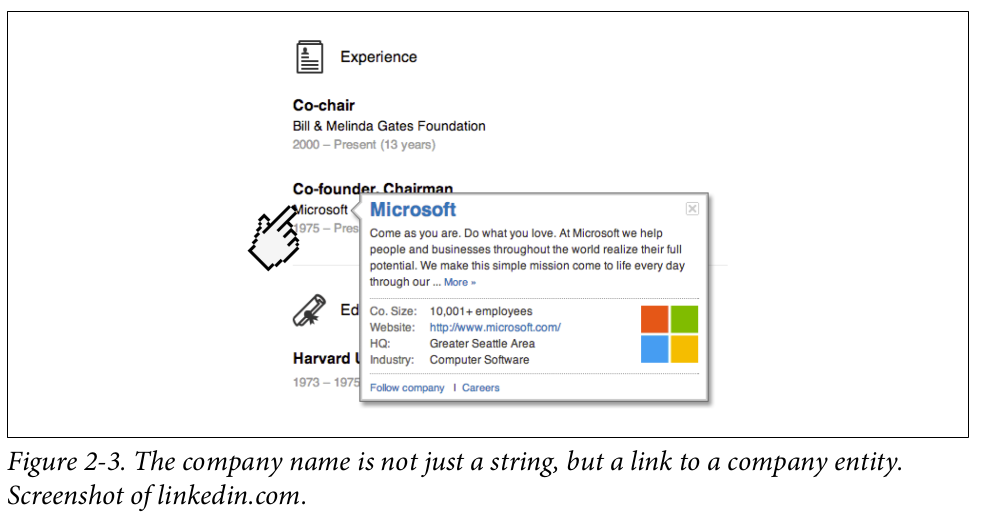
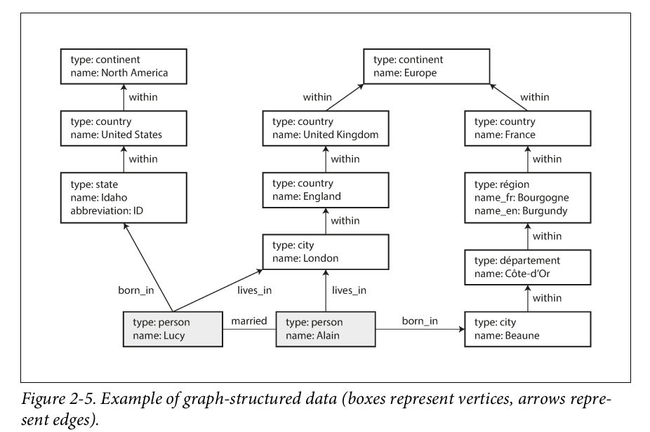

# Data Models and Query Languages

Applications are built by layering data models, each represented in terms of the layer beneath it. This process simplifies complexity through abstractions, enabling effective collaboration among developers and engineers. For example:

1. **High-level abstraction:** Objects or data structures are manipulated through APIs.
2. **Storage representation:** Data structures are expressed using general-purpose models like JSON, XML, tables, or graphs.
3. **Database internals:** These data models are translated into bytes for storage or processing by database software.
4. **Hardware representation:** Bytes are reduced to physical signals, like electrical currents or magnetic fields.

Each layer's data model introduces assumptions and trade-offs, influencing ease of use, performance, and transformation capabilities. Mastery of even one data model can be challenging, but its selection profoundly impacts the software's functionality, making it critical to choose a model suited to the application's needs.

## Relational Model vs Document Model

### Key Points:

- **Origins of the Relational Model:**
    - Introduced to abstract implementation details behind a clean interface.
    - Rooted in 1960s–70s business data processing tasks, such as:
        - Transaction processing (e.g., sales, banking, airline reservations).
        - Batch processing (e.g., invoicing, payroll, reporting).
- **Adoption and Dominance:**
    - Mid-1980s: Relational database management systems (RDBMS) and SQL became standard.
    - Supported diverse use cases beyond its business data origins, including:
        - Online publishing and discussion platforms.
        - E-commerce and social networking.
        - Games and software-as-a-service (SaaS) applications.
- **Competing Data Models:**
    - Alternatives over the years included:
        - **1970s–1980s:** Network and hierarchical models.
        - **Late 1980s–1990s:** Object databases.
        - **Early 2000s:** XML databases.
    - Each generated initial hype but failed to surpass the relational model.
- **Longevity and Adaptability:**
    - Relational databases proved versatile, supporting web-based applications and general-purpose data management tasks.

Relational databases remain integral to many modern systems, showcasing their enduring relevance and flexibility.

## The Birth of NoSQL

In the 2010s, NoSQL emerged as an alternative to the relational model. Initially coined as a hashtag for a 2009 meetup on open-source, distributed, non-relational databases, the term quickly gained traction and was later reinterpreted as "Not Only SQL."

### Key Drivers of NoSQL Adoption:

- **Scalability Needs:** Handling large datasets or high write throughput beyond relational databases' capabilities.
- **Open Source Preference:** Favoring free, open-source solutions over commercial databases.
- **Specialized Queries:** Supporting operations poorly suited to the relational model.
- **Flexible Data Models:** Addressing frustrations with rigid relational schemas by enabling more dynamic and expressive data representations.

### Future Outlook:

- Different applications have varying requirements, making a one-size-fits-all solution impractical.
- The likely trend is **polyglot persistence**, where relational databases coexist with diverse non-relational datastores, each suited to specific use cases.

## The Object-Relational Mismatch

Modern application development in object-oriented programming (OOP) often faces challenges when interacting with relational databases, as the data structures in OOP (objects) differ significantly from relational tables. This disconnect, known as **impedance mismatch**, necessitates translation layers.

### Addressing the Mismatch:

- **Object-Relational Mapping (ORM) Tools:**
    - Frameworks like ActiveRecord and Hibernate simplify the translation process but cannot fully eliminate the differences.
- **Relational Representations of Complex Data:**
    - Traditional SQL models (pre-SQL:1999) normalize data, using multiple tables for one-to-many relationships (e.g., positions, education, and contact info in separate tables linked to a user table).
    - Modern SQL standards and databases (e.g., PostgreSQL, MySQL, Oracle) support structured data types, XML, and JSON, allowing more complex data to be stored within a single row.
    - Some setups store complex data (e.g., jobs, education) as JSON or XML in text columns, leaving the application to interpret the structure.

### JSON as a Solution:

- JSON is simpler than XML and offers a natural representation of tree-like data structures, such as user profiles with nested details like positions, education, and contact information.
- **Advantages of JSON:**
    - **Better locality:** All profile data is stored in one place, requiring only a single query to retrieve it, unlike multi-table schemas that require joins or multiple queries.
    - **Natural tree structure:** The one-to-many relationships in data (e.g., user-to-positions) are directly represented in JSON.

### Example: User Profile in JSON

A JSON representation can encapsulate all user data, including:

- **Basic details:** User ID, name, and summary.
- **Nested structures:** Positions, education, and contact info as arrays or objects.

### Trade-offs:

While JSON reduces the mismatch between application code and storage, it has its limitations, such as limited query and indexing capabilities. This may present challenges, explored further in other chapters.

## Many-to-One and Many-to-Many Relationships

Storing data like `region_id` and `industry_id` as IDs instead of plain-text strings (e.g., "Greater Seattle Area" or "Philanthropy") offers several advantages:

### Benefits of Using IDs:

- **Consistency:** Ensures uniform style and spelling across records.
- **Ambiguity Reduction:** Helps differentiate entities with the same name.
- **Ease of Updates:** Centralized updates for names without modifying multiple records.
- **Localization Support:** Standardized lists can be translated for display in different languages.
- **Enhanced Search:** Enables more powerful queries (e.g., linking Seattle to Washington for searches).

### Normalization and Duplication

- Using IDs avoids duplicating human-readable information across records, simplifying updates and reducing inconsistencies.
- IDs remain stable over time, even if the associated human-readable information changes.

### Challenges in Document Databases:

- Normalized data requires many-to-one or many-to-many relationships, which relational databases handle efficiently with joins.
- **Document databases often lack robust join support**, requiring application code to emulate joins or maintain reference lists in memory.

### Evolving Data Models:

As applications grow, data often becomes more interconnected, leading to challenges in a document-based model. Examples include:

- **Entity References:** Organizations and schools, initially stored as strings, might later link to entities with additional data (e.g., logos, web pages).



- **Recommendations:** Adding features like recommendations between users introduces many-to-many relationships. For instance:
    - A recommendation links to the author and updates dynamically with changes, such as a new photo.
    - These references necessitate joins when querying, complicating a join-free document model.

### Implications:

While document models work well for self-contained data, interconnected features often require relational approaches or hybrid solutions. This highlights the trade-offs between simplicity in the document model and flexibility in relational databases.

## Are Document Databases Repeating History?

The debate on how to represent relationships in databases, revisited by NoSQL and document databases, dates back to early database systems like IBM’s hierarchical **Information Management System (IMS)** (1968). Similarities include:

### Hierarchical Model:

- **Structure:** Like JSON, data was stored as trees of nested records.
- **Strengths:** Effective for one-to-many relationships.
- **Limitations:** Difficulties with many-to-many relationships and no support for joins.
- **Developer Burden:** Data duplication or manual reference resolution was required.

### Historical Alternatives:

### **Network Model (CODASYL):**

- **Structure:** Generalized the hierarchical model by allowing records to have multiple parents, supporting many-to-many relationships.
- **Links as Pointers:** Relationships were defined using access paths, similar to pointers in programming.
- **Challenges:**
    - Required manual navigation through n-dimensional data spaces.
    - Queries were cursor-driven and relied on handwritten code.
    - Data model changes were complex due to tightly coupled query paths.

### **Relational Model:**

- **Structure:** Data was stored in flat tables (relations), making it easy to query and update without intricate access paths.
- **Advantages:**
    - Automatic query optimization (no manual path management).
    - Simple addition of indexes for new queries without rewriting code.
    - Easier application evolution due to flexibility in data access.
- **Impact:** Relational databases became dominant due to ease of use and adaptability.

### Document Databases vs. Relational:

- Document databases mimic hierarchical models by embedding one-to-many relationships within parent documents.
- For many-to-one and many-to-many relationships, both document and relational models use references (foreign keys in relational, document references in NoSQL).
- Unlike CODASYL, document databases avoid manual navigation but require multiple queries for joins.

### Key Insight:

Relational databases’ reliance on query optimizers streamlines access and supports long-term scalability, unlike hierarchical or network models. While document databases simplify one-to-many relationships, their handling of complex relationships often necessitates relational-like solutions.

## Relational Versus Document Databases Today

### Key Differences in Data Models:

1. **Document Databases:**
    - Offer **schema flexibility**, **locality performance**, and a structure resembling application data.
    - Best for **document-like structures** (tree of one-to-many relationships) where the entire structure is accessed at once.
    - **Limitations:**
        - Poor support for joins and many-to-many relationships.
        - Managing denormalized data increases application complexity.
        - Cannot directly reference nested items; entire documents are rewritten on updates.
2. **Relational Databases:**
    - Excel in **joins** and **many-to-many relationships**, with automatic query optimization.
    - More suitable for **highly interconnected data**.
    - Schema enforcement (schema-on-write) simplifies maintaining uniform structure but complicates schema changes.

### Schema Flexibility:

- **Document Databases (Schema-on-Read):**
    - Implicit, runtime interpretation of structure allows changes without migrations.
    - Useful for heterogeneous data or formats controlled by external systems.
- **Relational Databases (Schema-on-Write):**
    - Explicit schemas ensure consistency and provide clear documentation but require migrations for changes.

### Performance and Locality:

- Document databases store entire documents together, improving access performance for full-document queries.
- Updates and partial access are less efficient for large documents.
- Relational databases can achieve similar locality with advanced features like table interleaving (e.g., Google Spanner).

### Convergence of Models:

- **Relational Databases:** Increasingly support JSON and XML for semi-structured data.
- **Document Databases:** Some (e.g., RethinkDB, MongoDB) are adding relational-like joins.
- **Future Trend:** Hybrid models combining relational and document features are emerging, allowing applications to choose the best tools for their needs.

## Query Languages for Data

### Declarative vs. Imperative Query Languages:

1. **Imperative Query Languages:**
    - Explicitly specify how to retrieve and manipulate data, including the step-by-step operations.
    - Example (JavaScript-like pseudocode for filtering sharks):
        
        ```jsx
        javascript
        Copiar código
        function getSharks() {
            var sharks = [];
            for (var i = 0; i < animals.length; i++) {
                if (animals[i].family === "Sharks") {
                    sharks.push(animals[i]);
                }
            }
            return sharks;
        }
        
        ```
        
2. **Declarative Query Languages:**
    - Specify **what** data is needed, not **how** to retrieve it.
    - Example (SQL and relational algebra):In relational algebra:`sharks = σfamily = "Sharks" (animals)`
        
        ```sql
        sql
        Copiar código
        SELECT * FROM animals WHERE family = 'Sharks';
        
        ```
        

### Key Advantages of Declarative Query Languages:

1. **Abstraction:**
    - Hides the details of how queries are executed, enabling database systems to optimize performance behind the scenes.
    - Allows databases to change internal structures (e.g., reclaiming disk space) without breaking queries.
2. **Conciseness and Simplicity:**
    - Queries are typically shorter and easier to understand compared to imperative code.
3. **Automatic Optimization:**
    - The database system's query optimizer chooses efficient execution strategies, like using indexes or parallel joins, without user involvement.
4. **Parallel Execution:**
    - Declarative languages are more adaptable to modern CPU architectures, where performance gains come from parallelism (multiple cores) rather than clock speed increases.

### Limitations of Imperative Code:

- Tied to specific implementation details, like data ordering.
- Difficult to parallelize due to strict execution order.

Declarative languages like SQL offer significant advantages in flexibility, optimization, and scalability, making them essential for modern databases.

## MapReduce Querying

**Overview:**
MapReduce is a programming model designed for large-scale data processing across distributed systems, popularized by Google. It is supported in a limited form by some NoSQL databases, such as MongoDB and CouchDB, primarily for read-only queries.

**Characteristics of MapReduce:**

1. **Hybrid Nature:**
    - MapReduce is not fully declarative or imperative but lies in between. Queries are expressed with code snippets executed repeatedly by the framework.
    - Inspired by functional programming concepts (`map` and `reduce` functions).
2. **How It Works:**
    - **Map Function:**
    Processes each document, emitting key-value pairs.
    - **Reduce Function:**
    Aggregates values for each unique key.
    - Example (MongoDB query for monthly shark sightings):
        
        ```jsx
        db.observations.mapReduce(
          function map() { emit(year + "-" + month, this.numAnimals); },
          function reduce(key, values) { return Array.sum(values); },
          { query: { family: "Sharks" }, out: "monthlySharkReport" }
        );
        
        ```
        
    - Input:
        
        ```jsx
        {
          observationTimestamp: Date.parse("Mon, 25 Dec 1995"),
          family: "Sharks",
          numAnimals: 3
        },
        {
          observationTimestamp: Date.parse("Tue, 12 Dec 1995"),
          family: "Sharks",
          numAnimals: 4
        }
        
        ```
        
    - Output: `emit("1995-12", 7)` after reducing emitted values `[3, 4]`.
3. **Restrictions:**
    - Functions must be **pure** (no side effects or external database queries).
    - Enables fault-tolerance, re-execution, and distributed execution.

---

**Strengths and Limitations:**

1. **Strengths:**
    - Allows custom logic with code, such as JavaScript functions for parsing, calculations, and advanced queries.
    - Flexible and suitable for distributed systems.
2. **Limitations:**
    - Writing coordinated `map` and `reduce` functions is complex and error-prone compared to writing a single declarative query.
    - Lower optimization potential compared to declarative languages.

---

**Alternatives and Enhancements:**

1. **Aggregation Pipeline:**
    - Introduced in MongoDB 2.2 as a simpler, declarative alternative to MapReduce.
    - Example (monthly shark sightings query):
        
        ```jsx
        db.observations.aggregate([
          { $match: { family: "Sharks" } },
          { $group: {
              _id: {
                year: { $year: "$observationTimestamp" },
                month: { $month: "$observationTimestamp" }
              },
              totalAnimals: { $sum: "$numAnimals" }
            }
          }
        ]);
        
        ```
        
    - JSON-based syntax is similar to SQL in functionality but differs in style.
2. **SQL Compatibility:**
    - SQL, although declarative, can be implemented using MapReduce pipelines or other distributed execution strategies.
    - Advanced SQL databases can extend functionality with custom JavaScript functions, reducing the need for MapReduce in many cases.

**Takeaway:**
While MapReduce is powerful for distributed data processing, its complexity and lower optimization potential often make declarative approaches, such as SQL or MongoDB’s aggregation pipeline, more efficient and user-friendly. **NoSQL systems often end up mimicking SQL-like capabilities for usability and performance.**

## Graph-Like Data Models

Graph data models are ideal for representing data with complex, many-to-many relationships, where traditional document or relational models become cumbersome. Graphs consist of **vertices** (nodes/entities) and **edges** (relationships/arcs), providing a natural way to structure and query interconnected data.

**Examples of Graph Applications:**

1. **Social Graphs:** Vertices are people; edges represent friendships.
2. **Web Graphs:** Vertices are web pages; edges denote hyperlinks.
3. **Transport Networks:** Vertices are junctions; edges are roads or railways.

**Use Cases:**

- Algorithms like shortest path (navigation systems) and PageRank (web ranking).
- Homogeneous graphs (e.g., only people or web pages).
- Heterogeneous graphs (e.g., Facebook's graph combining people, locations, events, and interactions).



**Graph Models:**

1. **Property Graph Model:**
    - Implemented by Neo4j, Titan, and InfiniteGraph.
    - Vertices and edges have associated key-value pairs to store metadata or attributes.
2. **Triple-Store Model:**
    - Implemented by Datomic, AllegroGraph, and others.
    - Data is stored as subject-predicate-object triples, suitable for semantic web and RDF data.

**Query Languages for Graphs:**

1. **Declarative:**
    - **Cypher:** Used with Neo4j for property graphs.
    - **SPARQL:** Common for triple-stores and RDF data.
    - **Datalog:** Used in logical and rule-based graph queries.
2. **Imperative:**
    - **Gremlin:** A flexible, traversal-based query language.
    - **Graph Processing Frameworks:** Like Pregel, designed for large-scale distributed graph processing.

**Key Takeaway:**
Graph data models offer flexibility and efficiency for complex, interconnected data. They support a wide range of use cases, from social networks to web analytics, with diverse query languages tailored for different graph structures and processing needs.

## Property Graphs

In the property graph model, each vertex consists of:

- A unique identifier
- A set of outgoing edges
- A set of incoming edges
- A collection of properties (key-value pairs)

Each edge consists of:

- A unique identifier
- The vertex at which the edge starts (the tail vertex)
- The vertex at which the edge ends (the head vertex)
- A label do describe the kind of relationship between the two vertices
- A collection of properties (key-value pairs)

You can think of a graph store as consisting of two relational tables, one for vertices and one for edges (this schema uses the PostgreSQL json datatype to store the properties of each vertex or edge). The head and tail vertex are stored for each edge; if you want the set of incoming or outgoing edges for a vertex, you can query the edges table by head_vertex or tail_vertex, respectively.

```sql
CREATE TABLE vertices (
    vertex_id integer PRIMARY KEY,
    properties json
);
CREATE TABLE edges (
    edge_id
    integer PRIMARY KEY,
    tail_vertex integer REFERENCES vertices (vertex_id),
    head_vertex integer REFERENCES vertices (vertex_id),
    label
    text,
    properties json
);
CREATE INDEX edges_tails ON edges (tail_vertex);
CREATE INDEX edges_heads ON edges (head_vertex);
```

Some important aspects of this model are:

1. Any vertex can have an edge connecting it with any other vertex. There is no schema that restricts which kinds of things can or cannot be associated.
2. Given any vertex, you can efficiently find both its incoming and its outgoing edges, and thus traverse the graph—i.e., follow a path through a chain of vertices—both forward and backward. (That’s why the example has indexes on both the tail_vertex and head_vertex columns.)
3. By using different labels for different kinds of relationships, you can store several different kinds of information in a single graph, while still maintaining a clean data model.

<aside>
💡

Graphs are good for evolvability: as you add features to your application, a graph can easily be extended to accommodate changes in your application’s data structures.

</aside>

## **Cypher Query Language**

Cypher is a declarative query language designed for property graphs, primarily used with the Neo4j graph database. It uses an intuitive arrow notation to define relationships between nodes (vertices) and edges.

### **Key Features of Cypher:**

1. **Graph Creation:**
    - Cypher can define nodes (vertices) and relationships (edges) with labels and properties.
    - Example:
        
        ```
        cypher
        Copiar código
        CREATE
        (NAmerica:Location {name:'North America', type:'continent'}),
        (USA:Location {name:'United States', type:'country'}),
        (Idaho:Location {name:'Idaho', type:'state'}),
        (Lucy:Person {name:'Lucy'}),
        (Idaho) -[:WITHIN]-> (USA) -[:WITHIN]-> (NAmerica),
        (Lucy) -[:BORN_IN]-> (Idaho)
        
        ```
        
        - This creates locations (North America, USA, Idaho) and a person (Lucy), linking them with relationships like `WITHIN` and `BORN_IN`.
2. **Pattern Matching with `MATCH`:**
    - Cypher uses a `MATCH` clause to find patterns in a graph.
    - Example:
        
        ```
        cypher
        Copiar código
        MATCH
        (person) -[:BORN_IN]-> () -[:WITHIN*0..]-> (us:Location {name:'United States'}),
        (person) -[:LIVES_IN]-> () -[:WITHIN*0..]-> (eu:Location {name:'Europe'})
        RETURN person.name
        
        ```
        
        - Finds people who:
            1. Were born in the US (directly or via a location nested within it).
            2. Now live in Europe (directly or via a nested location).
        - Returns their names.
3. **Declarative Nature:**
    - Focuses on specifying **what** data to retrieve rather than **how** to retrieve it.
    - The query optimizer determines the most efficient execution plan.
4. **Efficient Execution:**
    - Cypher can leverage indexes (e.g., on properties like `name`) to quickly locate relevant nodes and edges, optimizing queries.

### **Benefits of Cypher:**

- **Readable Syntax:** Human-friendly arrow notation makes graph queries intuitive.
- **Flexibility:** Supports complex traversals through multi-hop relationships.
- **Optimization:** Execution details are handled by the database, simplifying query writing.

Cypher is a powerful tool for interacting with graph databases, offering both simplicity in syntax and robustness for handling complex graph queries.

## **Graph Queries in SQL**

Graph data can be represented and queried in relational databases using SQL, but this approach is less intuitive and more cumbersome compared to graph-specific query languages like Cypher.

### **Key Points:**

1. **Graph Data in Relational Databases:**
    - Graphs can be stored using relational structures (e.g., vertices and edges as tables).
    - SQL can query this data, but challenges arise when dealing with variable-length paths (e.g., traversing a hierarchy of locations).
2. **Variable-Length Traversals:**
    - Graph queries often require traversing an unknown number of edges (e.g., moving from a city to a region to a state).
    - Cypher handles this succinctly with syntax like `:WITHIN*0..` (traverse "WITHIN" edges zero or more times, akin to a regex  operator).
3. **SQL Approach with Recursive Queries:**
    - SQL:1999 introduced **recursive common table expressions (CTEs)**, enabling variable-length path queries.
    - Example:
        - A query to find people who emigrated from the US to Europe involves:
            1. Identifying locations in the US and Europe recursively.
            2. Finding people born in the US and living in Europe.
            3. Intersecting the two sets of people.
4. **Comparison:**
    - A Cypher query expressing this logic is concise (4 lines).
    - The equivalent SQL query using recursive CTEs is verbose (29 lines) and more complex.

While SQL can handle graph queries using recursive CTEs, the syntax is cumbersome, reflecting SQL's design for structured data rather than graph data. For applications involving frequent graph traversal, a graph database and a query language like Cypher are often more suitable. Selecting the right data model is critical for efficiency and clarity.

## Triple Stores and SPARQL

Triple-stores are a data model closely related to property graphs, designed to store information as triples of the form (subject, predicate, object). Tools like SPARQL provide efficient querying capabilities for triple-stores, which can serve as a robust internal data model regardless of their association with the semantic web.

### **Key Points:**

1. **Triple-Store Model:**
    - Data is stored in triples: `(subject, predicate, object)` (e.g., `(Jim, likes, bananas)`).
    - **Subjects:** Represent vertices in a graph.
    - **Objects:** Can be either:
        - Primitive values (e.g., a property like `(Lucy, age, 33)`).
        - Other vertices (e.g., a relationship like `(Lucy, marriedTo, Alain)`).
    - Predicates define edges in the graph or properties of vertices.
2. **Data Representation in Turtle:**
    - Turtle is a human-readable format for expressing triples.
    - Allows concise representation using prefixes and semicolons to group related properties.
    - RDF/XML is another format but is more verbose and harder to read.
    
    ```sql
    @prefix : <urn:example:>.
    
    _:lucy 
        a :Person;
        :name "Lucy";
        :bornIn _:idaho.
    
    _:idaho 
        a :Location;
        :name "Idaho";
        :type "state";
        :within _:usa.
    
    _:usa 
        a :Location;
        :name "United States";
        :type "country";
        :within _:namerica.
    
    _:namerica 
        a :Location;
        :name "North America";
        :type "continent".
    ```
    
3. **Semantic Web Context:**
    - The semantic web aimed to enable websites to share machine-readable data, forming an internet-wide "database."
    - Though largely unrealized, the semantic web inspired tools and standards (e.g., RDF, SPARQL) that remain useful for applications.
4. **SPARQL Query Language:**
    - SPARQL is a query language for triple-stores, similar to Cypher.
    - Concise syntax for pattern matching and querying triples.
    - Example: Finding people who moved from the US to Europe is compact in SPARQL:
        
        ```
        sparql
        Copiar código
        SELECT ?personName WHERE {
          ?person :name ?personName.
          ?person :bornIn / :within* / :name "United States".
          ?person :livesIn / :within* / :name "Europe".
        }
        
        ```
        
5. **Comparison with Cypher:**
    - SPARQL and Cypher have similar pattern-matching capabilities:
        - Cypher: `(person) -[:BORN_IN]-> () -[:WITHIN*0..]-> (location)`
        - SPARQL: `?person :bornIn / :within* ?location`
    - SPARQL unifies properties and edges under the term "predicate," streamlining syntax.

Triple-stores and SPARQL provide a flexible framework for representing and querying graph-like data. Despite its ties to the semantic web, SPARQL remains a powerful tool for internal application use, complementing other graph-oriented approaches like Cypher.

## **Comparison of Graph Databases and the CODASYL Network Model**

1. **Schema Flexibility**:
    - *CODASYL*: Rigid schema specifying which record types can nest within others.
    - *Graph Databases*: No restrictions on vertex connections, allowing greater adaptability to changing application requirements.
2. **Data Access**:
    - *CODASYL*: Access to records required traversing predefined paths.
    - *Graph Databases*: Vertices can be accessed directly via unique IDs or through indexed queries.
3. **Ordering**:
    - *CODASYL*: Maintained an ordered set of child records, influencing storage layout and requiring applications to manage record positions.
    - *Graph Databases*: Vertices and edges are unordered, with sorting handled at query time if needed.
4. **Query Language**:
    - *CODASYL*: Used imperative queries, which were complex and schema-dependent.
    - *Graph Databases*: Support high-level declarative query languages like Cypher or SPARQL, simplifying traversal and improving resilience to schema changes.

## Datalog Query Language

**Overview:**

- **Datalog** is an academic language studied since the 1980s and forms the foundation for query languages like SPARQL and Cypher.
- It is used in systems like Datomic and Cascalog for querying large datasets.

**Data Model:**

- Similar to the triple-store model but generalized: triples are written as `predicate(subject, object)`.Example: `name(lucy, 'Lucy')`.

**Querying with Rules:**

- Queries are built incrementally using **rules**, which define derived predicates based on existing data.
- **Rules Structure**:
    - `:-` separates the derived predicate (left-hand side) from its conditions (right-hand side).
    - Variables start with uppercase letters, and predicates are matched to the database records.

**Example Query:**

- Derived predicates like `within_recursive` and `migrated` are created by combining existing data and rules.
    - Recursive rules allow for hierarchical relationships, such as finding all locations within a region.
    - Example: Find people who migrated from the US to Europe:`?- migrated(Who, 'United States', 'Europe').`Result: `Who = 'Lucy'`.

**Key Features:**

1. **Incremental Queries**: Complex queries are built by combining small, reusable rules.
2. **Recursive Rules**: Enable traversal of hierarchical data relationships.
3. **Derived Data**: Rules generate new predicates dynamically without altering the database.

**Advantages:**

- Ideal for complex datasets and reusable logic.
- Allows flexible and modular query building.

**Challenges:**

- Requires a different mindset compared to declarative query languages like Cypher or SPARQL.
- Less convenient for simple, one-off queries.
