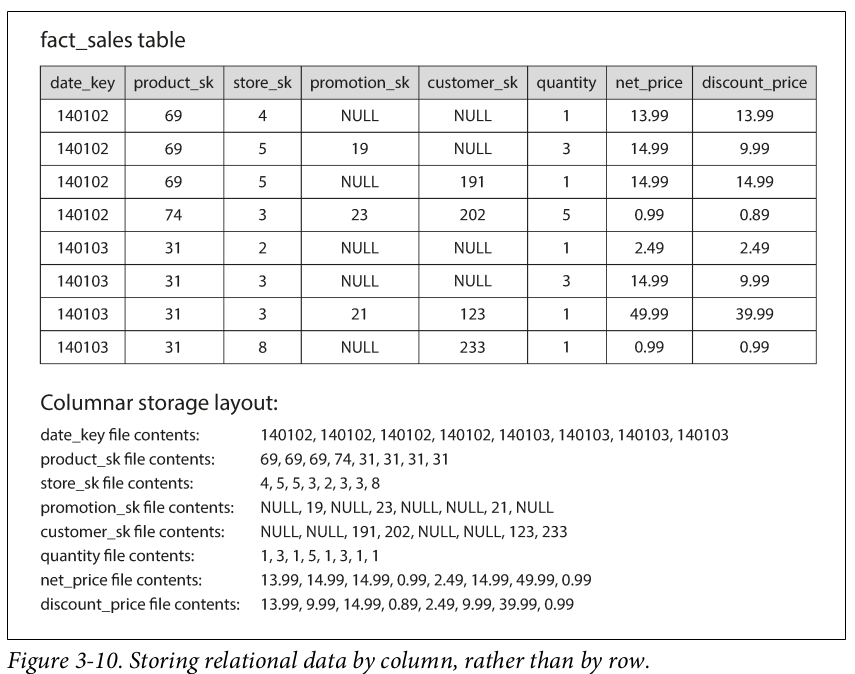

# Storage and Retrieval

- **Why should you, as an app dev, care how the database handles storage and retrieval internally?**
    - You’re probably not going to implement your own storage engine from scratch, but you do need to select a storage engine that is appropriate for your application, from the many that are available.

## Data Structures That Power Yor Database

Consider the world’s simplest database, implemented as two Bash functions:

```bash
db_set () {
echo "$1,$2" >> database
}
db_get () {
grep "^$1," database | sed -e "s/^$1,//" | tail -n 1
}
```

These two functions implement a key-value store. You can then call db_get key, which looks up the most recent value associated with that particular key and returns it.
And it works:

```bash
$ db_set 123456 '{"name":"London","attractions":["Big Ben","London Eye"]}'
$ db_set 42 '{"name":"San Francisco","attractions":["Golden Gate Bridge"]}'
$ db_get 42
{"name":"San Francisco","attractions":["Golden Gate Bridge"]}
```

The underlying storage format is very simple: a text file where each line contains a key-value pair, separated by a comma (roughly like a CSV file, ignoring escaping issues).

Our db_set function actually has pretty good performance for something that is so simple, because appending to a file is generally very efficient. On the other hand, our db_get function has terrible performance if you have a large number of records in your database (*O(n)* lookup cost). In order to efficiently find the value for a particular key in the database, we need a different data structure: an **index**. In this chapter we will look at a range of indexing structures and see how they compare.

- An index is an additional structure that is derived from the primary data.
- Many databases allow you to add and remove indexes, and this doesn’t affect the contents of the database; it only affects the performance of queries.
- Maintaining additional structures incurs overhead, especially on writes. Because the index also need to be updated every time data is written. **This is an important trade-off in storage systems.**

## Hash Indexes

- **Key-value stores** resemble dictionaries in programming languages and are often implemented using hash maps.
- Hash indexes use an **in-memory hash map** to map each key to a byte offset in a data file, allowing efficient retrieval of values by seeking to the corresponding location on disk.

### **How It Works**

1. **Appending Data**: Data is appended to a log file, while the hash map is updated with the byte offset of the new key-value pair.
2. **Lookup**: To retrieve a value, the hash map provides the offset in the file, and the database reads from that location.
3. **Example System**: Bitcask (used in Riak) implements this approach, offering high-performance reads and writes as long as all keys fit in memory.

### **Advantages**

- **Efficient Reads/Writes**: Values can be larger than available memory since they are read from disk when needed.
- **Sequential Writes**: Appending data and merging segments are sequential operations, which are faster than random writes, especially on spinning disks and SSDs.
- **Simpler Concurrency/Crash Recovery**: Append-only logs simplify handling crashes and concurrent access.

### **Challenges**

1. **Memory Limitation**: The hash table must fit entirely in memory, making it unsuitable for systems with an extremely large number of keys.
2. **Range Queries**: Hash indexes cannot efficiently handle range queries (e.g., scanning all keys between two values).

### **Compaction and Segment Merging**

- To prevent running out of disk space:
    - Logs are split into segments when they grow too large.
    - Older segments are compacted by discarding duplicate keys and keeping only the latest value for each key.
    - Segments can also be merged during compaction to reduce their number.

### **Additional Implementation Details**

- **File Format**: Binary formats are preferred over CSV for efficiency.
- **Deleting Records**: Deletions are handled using "tombstones" that mark keys as deleted during compaction.
- **Crash Recovery**: Hash maps can be reconstructed from segment files or restored quickly using snapshots stored on disk.
- **Concurrency Control**: A single writer thread appends data sequentially, while multiple threads can read immutable segment files concurrently.

### **Why Append-Only Design?**

- Avoids fragmentation of data files over time.
- Simplifies crash recovery by preventing partial overwrites.
- Optimized for sequential writes, which are faster than random writes.

### **Limitations**

- Memory constraints make it unsuitable for very large datasets with numerous keys.
- Inefficient for range queries since keys must be looked up individually.

In conclusion, hash indexes provide a simple yet effective way to index key-value data, particularly for workloads with frequent updates to a manageable number of keys. However, their limitations necessitate alternative indexing structures for larger datasets or range query requirements.

## SSTables and LSM-Trees

**SSTables (Sorted String Tables)** and **LSM-Trees (Log-Structured Merge Trees)** are foundational data structures for modern key-value storage engines, offering efficient write and read operations. Here's a breakdown of their key concepts and advantages:

### **SSTables**

1. **Definition**: SSTables are files containing sorted key-value pairs. Each key appears only once per file, and newer values overwrite older ones during the merging process.
2. **Advantages**:
    - **Efficient Merging**: Merging sorted files is straightforward, similar to the merge step in mergesort. When duplicate keys exist, the most recent value is retained.
    - **Sparse Indexing**: Only a sparse in-memory index is needed (e.g., one key per few kilobytes), as sorted order allows efficient range scans.
    - **Compression**: Key-value pairs can be grouped into blocks and compressed, saving disk space and reducing I/O bandwidth.

### **Constructing and Maintaining SSTables**

1. **Write Process**:
    - Incoming writes are stored in an in-memory balanced tree (e.g., a *memtable*), which keeps keys sorted.
    - When the memtable exceeds a size threshold, it is written to disk as an SSTable.
2. **Read Process**:
    - Reads first check the memtable, then successively older SSTable segments on disk until the key is found.
3. **Compaction**:
    - Background processes merge SSTables, discarding overwritten or deleted values to optimize storage and performance.
4. **Crash Recovery**:
    - A separate write-ahead log ensures durability by recording writes immediately, allowing recovery of the memtable after a crash.

### **LSM-Trees**

1. **Definition**: LSM-Trees extend SSTables by organizing them into a cascade of sorted files that are periodically merged and compacted in the background.
2. **Key Features**:
    - High write throughput due to sequential disk writes.
    - Efficient range queries enabled by sorted data.
3. **Optimizations**:
    - **Bloom Filters**: Used to avoid unnecessary disk reads for non-existent keys by approximating whether a key might exist.
    - **Compaction Strategies**:
        - *Size-Tiered*: Smaller SSTables are merged into larger ones over time (used by HBase).
        - *Leveled*: Data is split into levels with smaller SSTables at higher levels and older data at deeper levels (used by LevelDB and RocksDB).

### **Applications**

- LSM-Trees are widely used in storage engines like LevelDB, RocksDB, Cassandra, HBase, and indexing systems like Lucene (used in Elasticsearch and Solr). These systems leverage LSM-Trees for high write throughput, efficient range queries, and scalability even when datasets exceed available memory.

In summary, SSTables and LSM-Trees provide a robust foundation for scalable storage engines by combining sequential writes, efficient merging, sparse indexing, and background compaction processes. These features make them ideal for modern databases requiring high performance for both reads and writes.

## B-Trees

B-trees are the most widely used indexing structure in databases, introduced in 1970 and still dominant in both relational and non-relational databases. They organize key-value pairs in sorted order, enabling efficient lookups and range queries. Unlike log-structured indexes like LSM-trees, B-trees split the database into fixed-size pages (e.g., 4 KB) that correspond to hardware block sizes, rather than variable-sized segments.

### **Structure and Operations**

- **Tree Structure**:
    - A B-tree consists of pages organized into a tree hierarchy. The root page contains keys and references to child pages, which represent ranges of keys.
    - Leaf pages store individual keys and their values or references to those values.
    - The branching factor (number of child references per page) is typically several hundred, allowing B-trees to remain shallow (e.g., 3–4 levels deep for large databases).
- **Key Lookups**: Start at the root page and follow references based on key ranges until reaching the appropriate leaf page.
- **Updates**:
    - For updating a key’s value, the corresponding leaf page is modified and written back to disk.
    - Adding a new key may require splitting a full page into two, with updates propagating to parent pages to maintain balance.

### **Reliability**

- **Crash Recovery**:
    - B-trees rely on overwriting pages in place, which can lead to corruption if a crash occurs mid-update. To address this, databases use a *write-ahead log (WAL)* that records changes before applying them to the tree. The WAL ensures recovery to a consistent state after a crash.
- **Concurrency Control**: Multiple threads accessing the B-tree require latches (lightweight locks) to prevent inconsistencies. This is more complex than log-structured approaches that handle updates atomically in the background.

### **Optimizations**

Several optimizations have been developed over time:

1. **Copy-on-Write**: Instead of overwriting pages, some databases (e.g., LMDB) write modified pages to new locations and update parent references. This simplifies crash recovery and concurrency control.
2. **Key Abbreviation**: Storing abbreviated keys in interior pages saves space, increases branching factors, and reduces tree depth.
3. **Sequential Layout**: Efforts are made to store leaf pages sequentially on disk for efficient range scans, though maintaining this layout during updates is challenging.
4. **Sibling Pointers**: Leaf pages may include pointers to adjacent siblings for faster sequential scans without returning to parent nodes.
5. **Variants**: Fractal trees incorporate log-structured ideas to reduce disk seeks.

B-trees remain highly efficient for indexing due to their balanced structure, shallow depth, and adaptability through these optimizations.

### **Searching for an Item in a B-Tree Index**

To search for a key in a B-tree, the process involves traversing the tree from the root to the appropriate leaf node. Here's an example:

- **Scenario**: Search for the key **`49`** in a B-tree.
- **Steps**:
    1. Start at the root node, which contains keys and references to child nodes.
    2. Compare **`49`** with the keys in the root node. If **`49`** lies between two keys (e.g., **`32`** and **`64`**), follow the pointer to the corresponding child node.
    3. In the child node, repeat the comparison process. If you find an exact match for **`49`**, descend one position to the left to ensure you capture all occurrences of **`49`** in preceding leaf pages (if duplicates exist).
    4. Continue this process until reaching a leaf node where either:
        - The key **`49`** is found, and its associated value or reference is retrieved.
        - The key is not found, indicating it does not exist in the index.

This efficient traversal ensures that only one node per tree level is visited, resulting in *O*(log*n*) time complexity.

### **Updating an Item in a B-Tree Index**

Updating involves modifying an existing key's value or inserting a new key if it doesn't already exist. Here's an example:

- **Scenario**: Insert a new key **`75`** into a B-tree.
- **Steps**:
    1. Start at the root node and traverse down to find the appropriate leaf page where **`75`** should be inserted.
    2. If there is space in the leaf page, insert **`75`** into its sorted position within that page.
    3. If the leaf page is full:
        - Split the page into two, each half-full, and promote a middle key to the parent node to maintain balance.
        - If splitting causes the parent node to exceed its capacity, recursively split it as well, potentially propagating up to the root.
        - If the root splits, create a new root with references to two child nodes (the split halves).
    4. Write all modified pages back to disk.

This process ensures that the B-tree remains balanced after every update, maintaining *O(*log *n)* depth. These examples highlight how B-trees efficiently handle both searches and updates by leveraging their balanced structure and hierarchical organization of keys.

### Advantages of LSM-trees

- **Higher Write Throughput**: LSM-trees often sustain higher write throughput than B-trees. This is due to lower write amplification (in some configurations) and sequential writing of compact SSTable files, which is faster than overwriting multiple pages in a B-tree, especially on magnetic hard drives.
- **Better Compression and Lower Storage Overhead**: LSM-trees are not page-oriented and periodically rewrite SSTables to remove fragmentation, leading to better compression and smaller files compared to B-trees, which can leave disk space unused due to fragmentation.
- **Efficient Use of SSDs**: On SSDs, where the firmware often uses log-structured algorithms internally, LSM-trees' reduced write amplification and fragmentation allow more efficient use of I/O bandwidth.
- **Sequential Writes**: Sequentially writing SSTable files is particularly advantageous for magnetic hard drives, as sequential writes are significantly faster than random writes.

### **Downsides of LSM-Trees**

- **Compaction Overhead**: The compaction process can interfere with ongoing reads and writes, potentially leading to high response times for queries at higher percentiles. This issue becomes more pronounced at high write throughput when compaction struggles to keep up with incoming writes.
- **Disk Bandwidth Sharing**: As databases grow, compaction requires more disk bandwidth, which can reduce the bandwidth available for initial writes. If compaction cannot keep up, it may lead to unmerged segments, slower reads, and eventual disk space exhaustion.
- **Multiple Copies of Keys**: Unlike B-trees where each key exists in one place, LSM-trees may have multiple copies of the same key across different segments. This makes B-trees more suitable for databases requiring strong transactional semantics.

### **Comparison with B-Trees**

- **Performance Predictability**: B-trees generally provide more predictable performance for many workloads and are deeply integrated into traditional database architectures.
- **Transactional Semantics**: B-trees are advantageous for databases that rely on range locks for transaction isolation since keys exist in a single location in the index.

## **Other Indexing Structures**

- RDBMS often allow one clustered index per table, where the records are stored in the leaves of the index tree
- Secondary indexes can supplement the primary key
    - Secondary indexes usually don’t contain the data, just a reference to the location
        - Actual record storage can also be in a heap file, which is unordered
- Multi-column indexes are also used, sometimes as covering indexes
- Other kinds of indexes include full-text and spatial (multi-dimensional) indexes

### **In-memory databases**

- With RAM cost decreases, in-memory databases such as Memcached become viable
- Author states that the performance advantage of in-memory databases is not primarily due to avoiding slow reads from disk, but rather because they avoid the overhead of encoding data for writing to disk
- The *anti-caching* approach evicts LRU data from memory to disk without the overhead of durable on-disk data structures, akin to OS swap files

## **Transaction Processing or Analytics**

- Early days of business data processing was dominated by commercial transactions, leading to the term *online transaction processing* (OLTP)
- Transactional workload typically see small numbers of records being looked up, and mostly single records inserted or updated based on user input
- Patterns for analytics (usage of term OLAP has diminished) differ in the common case being reads across large numbers of records, and often aggregate numbers (e.g. sum of revenue) being calculated. In the past, majority of writes might be bulk loads, but streaming becoming more common

### **Data Warehousing**

- To guard low latency performance of OLTP systems, organizations started creating separate systems called data warehouses for analytic workloads
- A read-only copy of data was extracted from OLTP systems, cleaned & made consistent, and loaded into the data warehouse, using what came to be known as the *Extract-Transform-Load* (ETL) process
- The data model for data warehouses was relational for a long time, but divergence to other models such as Hadoop has occurred, independent of whether SQL is still the query language

### **Stars and Snowflakes:  Schemas for Analytics**

- Many data warehouses use a *star schema*, also known as *dimensional modeling*
    - At the center of the schema is a fact table, with *facts* representing individual events, usually very wide with lots of columns
    - Facts have event-specific data elements in some columns, but foreight key references (e.g. product ID) in others
    - The other, typically smaller, tables surrounding the fact table are *dimension tables*
- A visual diagram of dimension tables around a central fact table, often with relationship arrows, looks a lot like a star
- If dimensions are stored more normalized, e.g. countries having subdimensions for regions, and possibly regions broken into states, then the addition branching makes the diagram look more like a snowflake, thus the term *snowflake schema*
- A data warehouse may have multiple fact tables, thus multiple stars/snowflakes

## **Column-Oriented Storage**

- Data warehouses are common in large organizations, so it becomes a challenge how to optimize queries against fact tables with billions or trillions of rows
- Taking advantage of the fact that typically each analytic query only needs a small number of the many columns in a fact table, you can reduce reads by physically storing chunks of column data together, instead of physically storing chunks of records (rows)



- Columns from the same fact table must all store the rows in the same order

### Column Compression

- Provides additional benefit:
    - The number of distinct values in a column is usually small compared to the number of rows
    - You can use bitmap encoding (a form of one-hot encoding) and run-length encoding (RLE) to shrink the amount of space needed to store a column’s contents
    
    **How Bitmap Encoding Works**
    
    Imagine a company database with a column named **`Department`** that stores the department of employees. The column has **low cardinality**, meaning it contains only a few distinct values, such as **`HR`**, **`Finance`**, **`IT`**, and **`Sales`**. Suppose there are 10 rows of employee data:
    
    | **EmployeeID** | **Department** |
    | --- | --- |
    | 1 | HR |
    | 2 | IT |
    | 3 | HR |
    | 4 | Sales |
    | 5 | Finance |
    | 6 | IT |
    | 7 | Sales |
    | 8 | HR |
    | 9 | Finance |
    | 10 | IT |
    1. **Bitmap Encoding**
    
    For each unique value in the Department column, we create a **bitmap** (a sequence of bits). Each bit corresponds to a row in the table:
    
    - If the row belongs to that department, the bit is set to **`1`**.
    - Otherwise, it is set to **`0`**.
    
    The bitmaps for each department are as follows:
    
    - **HR**: **`1010000100`**
    - **Finance**: **`0000100010`**
    - **IT**: **`0100010001`**
    - **Sales**: **`0001001000`**
    1. **Compression**
    
    To save storage space, these bitmaps are compressed using techniques like **Run-Length Encoding (RLE)**. RLE compresses consecutive repeating bits. For example:
    
    - The bitmap for **`HR`** (**`1010000100`**) can be encoded as **`(1,1), (0,1), (1,1), (0,6)`**, where each pair represents the bit value and its count.
    1. **Query Efficiency**
    
    Bitmap encoding allows efficient query processing using **bitwise operations**:
    
    - To find employees in both **`HR`** and **`IT`**, perform a bitwise AND between their bitmaps:
        
        ***HR:1010000100***
        ***IT:0100010001***
        ***AND:0000000000***
        
    
    Result: No employees belong to both departments.
    
    - To find employees in either **`HR`** or **`Finance`**, perform a bitwise OR:
        
        ***HR:1010000100***
        
        ***Finance:0000100010***
        
        ***OR:1010100110***
        
    
    Result: Employees with IDs **`1,3,5,8,9`**.
    
    ### **Run-length encoding**
    
    **HR Bitmap:** The bitmap for the HR department is`1010000100`.
    
    RLE compresses the bitmap by grouping consecutive identical bits and recording their value (1 or 0) along with how many times they repeat. Here's how it works step by step:
    
    1. Start with the first bit (**`1`**) and count how many times it repeats consecutively.
    2. When the bit changes (from **`1`** to **`0`**), record the count of the previous bit and start counting the new bit.
    3. Continue this process until the end of the bitmap.
    
    **Step-by-Step Compression**
    
    - The first bit is **`1`**, and it appears **once** → **`(1, 1)`**
    - The next bit is **`0`**, and it appears **once** → **`(0, 1)`**
    - The next bit is **`1`**, and it appears **once** → **`(1, 1)`**
    - The next sequence is **`0000`** (four consecutive **`0`**s) → **`(0, 4)`**
    - The next bit is **`1`**, and it appears **once** → **`(1, 1)`**
    - The final sequence is **`00`** (two consecutive **`0`**s) → **`(0, 2)`**
    
    **Compressed RLE Output**
    
    The RLE representation of the bitmap is:
    
    `text[(1, 1), (0, 1), (1, 1), (0, 4), (1, 1), (0, 2)]`
    
    **Benefits of RLE**
    
    - This compressed form significantly reduces storage requirements for long sequences of identical bits.
    - Instead of storing all 10 bits, we store only 6 pairs of values.
    
    This approach can be applied to other department bitmaps (Finance, IT, Sales) to achieve similar compression benefits.
    

### Memory bandwidth and vectorized processing

- Modern CPUs have complex instruction sets, including ability to perform simple SIMD operations like AND and OR against L1 cache much faster than explicit loops over individual data elements
- Sort order in column storage
    - Just as vanilla log files are append-only in no particular order, but SSTables are sorted, you can sort column store data

## Sort Order in Column Storage

- Sorted order will help with compression of the sort key columns
- C-Store implemented replication with different replicas having different sort orders. In the common case, you can choose a particular replica if its sort order matches the range criteria of your query
- Writes to column stores are more complex
    - As with LSM-trees, we can have a two-level structure where batches of data are accumulated in memory, then periodically merged and written to disk. The sort order and compression work is batched behind the scenes.

## **Aggregation:  Data Cubes and Materialized Views**

- If you know certain aggregations are going to be frequently requested, e.g. sum of sales per department per store per day, you can save a physical copy of that data in a *materialized view*
- A data *cube* stores not just one view, but rather aggregations by multiple dimensions, e.g. all totals of sales by department, totals by store, totals by day, totals by department & store, totals by department & day, totals by store & day, and totals by department & store & day. If you visualize three dimensions, as in this example, you arrange all of the totals by department & store & day in a cube. Two-element subtotals would be sums by row, column, or stack. One-element subtotals would be sums across squares of numbers.
