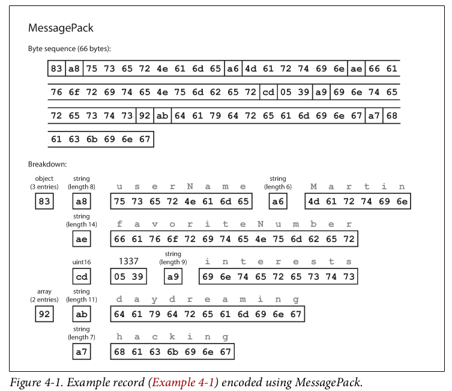

# Encoding and Evolution

1. **Evolvability**: Systems should be designed to adapt to changes, such as new features or modified user requirements, which often require changes to stored data (e.g., new fields or record types).
2. **Schema Management**:
    - **Relational Databases**: Use a single schema at any given time, which can be altered via schema migrations (e.g., `ALTER` statements).
    - **Schema-on-Read Databases**: Allow flexibility by not enforcing a schema, enabling older and newer data formats to coexist.
3. **Compatibility Challenges**:
    - **Rolling Upgrades**: Server-side applications often deploy updates gradually to avoid downtime, leading to temporary coexistence of old and new code and data formats.
    - **Client-Side Applications**: Updates depend on users, so older versions may persist for some time.
4. **Compatibility Requirements**:
    - **Backward Compatibility**: Newer code must be able to read data written by older code.
    - **Forward Compatibility**: Older code must be able to read data written by newer code (often harder to achieve, as older code must ignore new additions).
5. **Data Encoding Formats**: The chapter explores how formats like JSON, XML, Protocol Buffers, Thrift, and Avro handle schema changes and support compatibility. It also discusses their use in data storage, communication (e.g., REST, RPC), and message-passing systems (e.g., actors, message queues).

The focus is on ensuring smooth system operation during transitions by maintaining compatibility between different versions of code and data formats.

## Formats for Encoding Data

1. **Data Representations**:
    - **In-Memory**: Data is stored in structures like objects, arrays, hash tables, and trees, optimized for CPU access and manipulation (often using pointers).
    - **On Disk/Network**: Data must be encoded into a self-contained sequence of bytes (e.g., JSON) since pointers and in-memory structures are not meaningful outside the original process.
2. **Terminology**:
    - The term **serialization** is often used for this process but is avoided in the book to prevent confusion with its use in the context of transactions. Instead, **encoding** is preferred.
3. **Encoding Formats**:
    - There are numerous libraries and formats for encoding data, each with its own trade-offs. The text sets the stage for a deeper exploration of these formats, such as JSON, XML, Protocol Buffers, Thrift, and Avro.

## Language-Specific Formats

Built-in or third-party libraries used to serialize in-memory objects into byte sequences. While convenient, these formats come with significant drawbacks:

1. **Convenience**:
    - Languages like Java (`java.io.Serializable`), Ruby (`Marshal`), and Python (`pickle`) provide easy-to-use encoding mechanisms for saving and restoring in-memory objects with minimal code.
2. **Key Problems**:
    - **Language Lock-in**: The encoding is often specific to a single programming language, making it difficult to read or process the data in other languages. This limits interoperability and long-term flexibility.
    - **Security Risks**: Decoding data often requires instantiating arbitrary classes, which can be exploited by attackers to execute arbitrary code or cause other security issues.
    - **Poor Versioning Support**: These libraries typically lack robust mechanisms for handling forward and backward compatibility, making it hard to evolve data formats over time.
    - **Inefficiency**: Many language-specific encodings are poorly optimized, resulting in slow performance and large encoded data sizes (e.g., Java’s built-in serialization is known for being slow and bloated).
3. **Recommendation**:
    - Due to these issues, language-specific encoding formats should only be used for **very transient purposes** (e.g., short-lived data exchange within the same application). For long-term storage or cross-language interoperability, more robust and language-agnostic formats (e.g., JSON, Protocol Buffers, Avro) are preferred.

## JSON, XML, and Binary Variants

1. **Popularity and Use Cases**:
    - JSON, XML, and CSV are widely used for data interchange due to their language independence and human readability.
    - JSON is favored for its simplicity and built-in browser support.
    - XML is more verbose and complex but has robust schema support.
    - CSV is simple but lacks schema and has ambiguities (e.g., handling commas or newlines in values).
2. **Key Limitations**:
    - **Ambiguity in Data Types**:
        - JSON and XML struggle with precise number representation (e.g., large integers like Twitter’s tweet IDs may lose precision in JSON).
        - CSV cannot distinguish between numbers and strings without external context.
    - **Lack of Binary String Support**:
        - JSON and XML support Unicode text but not binary strings, requiring workarounds like Base64 encoding (which increases data size by 33%).
    - **Schema Support**:
        - XML and JSON schemas are powerful but complex and often underused, especially in JSON-based tools.
        - CSV has no schema, requiring applications to manually interpret rows and columns.
3. **Human-Readability**:
    - Textual formats are somewhat human-readable, but their syntax and limitations (e.g., verbosity in XML, ambiguity in CSV) can be problematic.

### **Binary Encoding**

1. **Motivation**:
    - For internal use within an organization, binary formats can offer significant advantages in terms of compactness and parsing speed, especially for large datasets (e.g., terabytes of data).
2. **Binary Variants of JSON and XML**:
    - Formats like **MessagePack**, **BSON**, **WBXML**, and **Fast Infoset** provide binary encodings for JSON and XML.
    - These formats reduce space usage and improve parsing speed but sacrifice human-readability.
    - They often extend data types (e.g., distinguishing integers and floats, supporting binary strings) but retain the JSON/XML data model.
3. **Example: MessagePack**:
    - MessagePack encodes JSON data into a compact binary format.
    - For example, the JSON object `{"userName": "Martin", "favoriteNumber": 1337, "interests": ["daydreaming", "hacking"]}` is encoded into 66 bytes (compared to 81 bytes in JSON).
    - The encoding includes metadata like field names and lengths, which reduces the need for escaping or delimiters.
4. **Trade-offs**:
    - Binary formats offer only modest space savings compared to textual formats (e.g., 66 vs. 81 bytes in the example).
    - The loss of human-readability and the marginal gains in space and speed may not always justify the use of binary encodings.



## Thrift and Protocol Buffers

### **Schema-Based Encoding**

1. **Schema Definition**:
    - Both Thrift and Protocol Buffers require a schema to encode data. The schema defines the structure of the data, including field names, types, and tags.
    - Example schema for **Thrift**:
        
        ```
        struct Person {
          1: required string userName,
          2: optional i64 favoriteNumber,
          3: optional list<string> interests
        }
        ```
        
    - Example schema for **Protocol Buffers**:
        
        ```
        message Person {
          required string user_name = 1;
          optional int64 favorite_number = 2;
          repeated string interests = 3;
        }
        ```
        
    - Both tools generate code from the schema to encode and decode data in various programming languages.
2. **Binary Encoding**:
    - **Thrift** offers two binary encoding formats:
        - **BinaryProtocol**: Encodes data with field tags and type annotations (e.g., 59 bytes for the example schema).
        
         
        
        - **CompactProtocol**: A more efficient format (e.g., 34 bytes for the same data) using variable-length integers and bit packing.
        
        
        
    - **Protocol Buffers** uses a single binary encoding format, similar to Thrift’s CompactProtocol, and encodes the example data in 33 bytes.
    
        
    
    - Both formats omit field names, using numeric **field tags** instead, which reduces the encoded data size.

### **Schema Evolution**

1. **Backward and Forward Compatibility**:
    - **Field Tags**: Critical for compatibility. Field names can be changed, but tags must remain constant.
    - **Adding Fields**: New fields can be added with new tag numbers. Old code ignores unrecognized tags, maintaining **forward compatibility**.
    - **Removing Fields**: Fields can only be removed if they are optional. Removed tags must never be reused to avoid conflicts with old data.
    - **Required vs. Optional**: New fields must be optional or have default values to maintain **backward compatibility**.
2. **Datatype Changes**:
    - Changing datatypes (e.g., 32-bit to 64-bit integers) is possible but risky. New code can read old data by filling missing bits, but old code may truncate values when reading new data.
    - **Protocol Buffers**: Uses a `repeated` marker for lists instead of a dedicated list type. This allows evolving an `optional` field into a `repeated` field.
    - **Thrift**: Uses a dedicated list datatype, which supports nested lists but doesn’t allow the same single-to-multi-valued evolution as Protocol Buffers.

### **Key Differences**

1. **Encoding Formats**:
    - Thrift offers both BinaryProtocol and CompactProtocol, while Protocol Buffers has a single, compact binary format.
    - Protocol Buffers’ encoding is slightly more compact (33 bytes vs. Thrift’s 34 bytes for the example data).
2. **List Handling**:
    - Protocol Buffers uses a `repeated` marker, allowing flexible evolution from single-valued to multi-valued fields.
    - Thrift uses a dedicated list type, which supports nested lists but lacks the same flexibility for schema evolution.
3. **Required vs. Optional**:
    - Both systems support `required` and `optional` fields, but `required` fields can complicate schema evolution and are generally discouraged.

## Avro

1. **Schema Definition**:
    - Avro uses schemas to define the structure of data. It supports two schema languages:
        - **Avro IDL**: A human-readable format.
        - **JSON**: A machine-readable format.
    - Example schema for a `Person` record:
        
        ```
        record Person {
          string userName;
          union { null, long } favoriteNumber = null;
          array<string> interests;
        }
        ```
        
        Equivalent JSON schema:
        
        ```json
        {
          "type": "record",
          "name": "Person",
          "fields": [
            {"name": "userName", "type": "string"},
            {"name": "favoriteNumber", "type": ["null", "long"], "default": null},
            {"name": "interests", "type": {"type": "array", "items": "string"}}
          ]
        }
        ```
        
2. **Binary Encoding**:
    - Avro’s binary encoding is compact (e.g., 32 bytes for the example schema, the smallest among Thrift, Protocol Buffers, and Avro).
    - The encoded data consists of concatenated values without field identifiers or type annotations. The schema is required to interpret the data correctly.
    
    
    

### **Schema Evolution**

1. **Writer’s Schema and Reader’s Schema**:
    - **Writer’s Schema**: The schema used to encode the data.
    - **Reader’s Schema**: The schema expected by the application decoding the data.
    - Avro resolves differences between the two schemas during decoding, ensuring compatibility even if the schemas are not identical.
    - If the code reading the data encounters a field that appears in the writer’s schema but not in the reader’s schema, it is ignored.
    - If the code reading the data expects some field, but the writer’s schema does not contain a field of that name, it is filled in with a default value declared in the reader’s schema.
    
    
    
2. **Compatibility Rules**:
    - **Forward Compatibility**: New writer schema + old reader schema.
    - **Backward Compatibility**: Old writer schema + new reader schema.
    - To maintain compatibility:
        - Fields can only be added or removed if they have default values.
        - Changing field names or adding branches to union types is backward compatible but not forward compatible.
    - **Default Values**: Required for added fields to ensure compatibility. For example, `favoriteNumber` has a default value of `null`.
3. **Handling Nulls**:
    - Avro requires explicit use of union types (e.g., `union { null, long }`) to allow fields to be `null`. This prevents bugs by making nullability explicit.

---

### **Schema Resolution**

1. **How the Reader Knows the Writer’s Schema**:
    - **Large Files**: The writer’s schema is stored once at the beginning of the file (e.g., Avro object container files).
    - **Databases**: Each record includes a version number, and the corresponding schema is fetched from a schema registry.
    - **Network Communication**: Schemas are negotiated during connection setup and used for the duration of the session.
2. **Dynamic Schemas**:
    - Avro is well-suited for dynamically generated schemas (e.g., exporting relational database contents). Field names, rather than tags, are used to match data, making schema changes easier to handle.
    - In contrast, Thrift and Protocol Buffers require manual assignment of field tags, complicating dynamic schema generation.

---

### **Code Generation**

1. **Optional Code Generation**:
    - Avro supports code generation for statically typed languages (e.g., Java, C++) but does not require it.
    - In dynamically typed languages (e.g., JavaScript, Python), Avro can be used without code generation, making it more flexible for dynamic data processing.
2. **Self-Describing Data**:
    - Avro files (e.g., object container files) include the writer’s schema, making them self-describing. This is useful for tools like Apache Pig, which can process Avro files without prior knowledge of the schema.

---

### **Advantages of Avro**

1. **Compactness**: Avro’s binary encoding is highly efficient, often smaller than Thrift or Protocol Buffers.
2. **Schema Evolution**: Robust support for schema changes with backward and forward compatibility.
3. **Dynamic Schemas**: Easier to handle dynamically generated schemas compared to Thrift and Protocol Buffers.
4. **Flexibility**: Works well with both statically and dynamically typed languages, with optional code generation.

## The Merits of Schemas

1. **Compactness**:
    - Schema-based binary encodings are more compact than textual formats or even binary JSON variants because they omit field names from the encoded data. Instead, they use schema-defined field tags or positional information.
2. **Documentation and Accuracy**:
    - The schema serves as a form of **documentation** that is always up to date, as it is required for decoding data. This eliminates the risk of documentation diverging from the actual data format.
3. **Schema Evolution and Compatibility**:
    - Schema-based systems support **schema evolution**, enabling forward and backward compatibility.
    - A **schema registry** can be used to validate compatibility before deploying changes, ensuring smooth transitions between schema versions.
4. **Code Generation for Static Typing**:
    - For statically typed languages (e.g., Java, C++), code generation from schemas enables **compile-time type checking**, improving developer productivity and reducing runtime errors.

---

### **Comparison to Textual Formats**

1. **Textual Formats (JSON, XML, CSV)**:
    - Widely used and human-readable but suffer from inefficiency (e.g., verbosity in XML, ambiguity in CSV, and lack of binary support in JSON).
    - Lack robust support for schema evolution and validation.
2. **Binary Encodings (Protocol Buffers, Thrift, Avro)**:
    - More efficient in terms of space and parsing speed.
    - Provide stronger guarantees about data structure and compatibility through schemas.

---

### **Historical Context**

1. **ASN.1**:
    - A schema definition language standardized in 1984, used in network protocols and SSL certificates (X.509).
    - Similar to modern schema-based encodings (e.g., supports schema evolution using tag numbers) but is complex and poorly documented, making it less suitable for new applications.
2. **Proprietary Binary Encodings**:
    - Many systems (e.g., relational databases) use custom binary encodings for network protocols, often decoded by vendor-provided drivers (e.g., ODBC, JDBC).

---

### **Advantages Over Schemaless Formats**

1. **Flexibility with Guarantees**:
    - Schema-based formats provide the same flexibility as schemaless JSON databases (e.g., schema-on-read) but with stronger guarantees about data structure and compatibility.
    - They also offer better tooling, such as code generation and schema validation.
2. **Improved Data Quality**:
    - Schemas ensure that data adheres to a defined structure, reducing the risk of errors and inconsistencies.

---

### **Conclusion**

- Schema-based binary encodings like **Protocol Buffers**, **Thrift**, and **Avro** offer significant advantages over textual formats and schemaless systems:
    - **Compactness**: More efficient storage and transmission.
    - **Documentation**: Schemas provide accurate, up-to-date documentation.
    - **Compatibility**: Robust support for schema evolution and validation.
    - **Tooling**: Code generation and type checking for statically typed languages.
- These benefits make schema-based encodings a strong choice for applications requiring efficient data storage, interoperability, and evolvability.

### **Dataflow Through Databases**

1. **Encoding and Decoding**:
    - **Writer**: The process that writes data to the database encodes it.
    - **Reader**: The process that reads data from the database decodes it.
    - This can involve a single process (e.g., writing data for future retrieval) or multiple processes (e.g., different applications or service instances accessing the same database).
2. **Compatibility Requirements**:
    - **Backward Compatibility**: Necessary to ensure that newer code can read data written by older code.
    - **Forward Compatibility**: Necessary to ensure that older code can read data written by newer code, especially during rolling upgrades where different versions of the application coexist.
3. **Handling Unknown Fields**:
    - When newer code writes data with additional fields, older code should preserve these fields even if it cannot interpret them.
    - Some encoding formats (e.g., Avro, Protocol Buffers) support preserving unknown fields, but application-level logic may be needed to ensure these fields are not lost during updates.

---

### **Data Longevity and Schema Evolution**

1. **Data Outlives Code**:
    - Data in a database can persist for years, while application code is frequently updated. This means the database may contain data encoded in multiple schema versions.
    - Schema evolution allows the database to appear as if it uses a single schema, even though the underlying data may be encoded with various historical schemas.
2. **Schema Changes**:
    - Simple schema changes (e.g., adding a column with a default value) can often be applied without rewriting existing data.
    - More complex changes may require data migration, which can be expensive for large datasets.
3. **Example: LinkedIn’s Espresso**:
    - Uses Avro for storage, leveraging Avro’s schema evolution rules to handle changes over time.

---

### **Archival Storage**

1. **Data Snapshots**:
    - Snapshots of the database (e.g., for backups or data warehousing) are typically encoded using the latest schema, even if the source database contains data in multiple schema versions.
    - Immutable formats like **Avro object container files** are well-suited for archival storage.
2. **Analytics-Friendly Formats**:
    - Archival data can be encoded in column-oriented formats like **Parquet**, which are optimized for analytics and query performance.

---

### **Key Takeaways**

- **Databases as Dataflow**: Databases act as intermediaries in dataflow, with processes encoding data when writing and decoding it when reading.
- **Schema Evolution**: Ensures compatibility between different versions of data and code, allowing databases to handle changes over time without requiring costly data migrations.
- **Archival Storage**: Snapshots of databases are often encoded in the latest schema and stored in immutable, analytics-friendly formats for long-term use.

## Dataflow Through Services: REST and RPC

### **Service-Oriented Architecture (SOA) and Microservices**

1. **Client-Server Model**:
    - Servers expose APIs, and clients make requests to these APIs over a network.
    - Examples include web browsers (clients) making requests to web servers, or mobile apps interacting with backend services.
2. **Decomposition of Applications**:
    - Applications are often decomposed into smaller services (microservices), each responsible for specific functionality.
    - This allows teams to develop, deploy, and evolve services independently.
3. **Compatibility**:
    - Services must maintain backward and forward compatibility to support independent deployment and evolution of clients and servers.

---

### **Web Services: REST and SOAP**

1. **REST (Representational State Transfer)**:
    - A design philosophy built on HTTP principles.
    - Emphasizes simplicity, using URLs for resource identification and HTTP features for caching, authentication, and content negotiation.
    - RESTful APIs are popular for public APIs and microservices due to their simplicity and broad support.
2. **SOAP (Simple Object Access Protocol)**:
    - An XML-based protocol for making network API requests.
    - Relies on a complex set of standards (WS-*) and uses WSDL (Web Services Description Language) for API description.
    - While powerful, SOAP is often criticized for its complexity and poor interoperability, leading to its decline in popularity compared to REST.
3. **Comparison**:
    - **REST**: Simpler, more flexible, and widely supported. Uses JSON or other lightweight formats.
    - **SOAP**: More rigid, complex, and relies heavily on tooling and code generation. Uses XML.

---

### **Remote Procedure Call (RPC)**

1. **RPC Concept**:
    - Aims to make network requests look like local function calls (location transparency).
    - Examples include Java RMI, CORBA, and modern frameworks like gRPC and Thrift.
2. **Problems with RPC**:
    - **Unpredictability**: Network requests can fail, time out, or have variable latency.
    - **Retries and Idempotence**: Retrying failed requests can lead to duplicate actions unless idempotence is enforced.
    - **Data Encoding**: Parameters must be serialized for transmission, which can be inefficient for complex objects.
    - **Language Interoperability**: RPC frameworks must handle differences in data types across programming languages.
3. **Modern RPC Frameworks**:
    - Frameworks like **gRPC**, **Thrift**, and **Avro** address some RPC limitations by supporting asynchronous operations, streams, and service discovery.
    - These frameworks use efficient binary encodings (e.g., Protocol Buffers, Avro) for better performance.

---

### **Data Encoding and Evolution for RPC**

1. **Compatibility Requirements**:
    - **Backward Compatibility**: Servers must handle requests from older clients.
    - **Forward Compatibility**: Clients must handle responses from newer servers.
    - RPC frameworks inherit compatibility rules from their encoding formats (e.g., Thrift, Protocol Buffers, Avro).
2. **Versioning**:
    - API versioning is critical for maintaining compatibility, especially for public APIs.
    - Common approaches include version numbers in URLs, HTTP headers, or API keys.

---

### **REST vs. RPC**

1. **REST**:
    - Advantages: Simple, human-readable, widely supported, and easy to debug.
    - Disadvantages: Less efficient for large-scale or performance-critical systems.
2. **RPC**:
    - Advantages: Efficient, supports advanced features like streaming and service discovery.
    - Disadvantages: More complex, less flexible, and harder to debug.

## Message Passing Dataflow

1. **Overview**:
    - Message-passing systems sit between **RPC** (direct, synchronous communication) and **databases** (persistent, asynchronous storage).
    - Messages are sent via a **message broker** (or message queue), which temporarily stores messages and delivers them to recipients.
2. **Advantages of Message Brokers**:
    - **Buffering**: Handles situations where the recipient is unavailable or overloaded.
    - **Reliability**: Automatically redelivers messages if a process crashes, preventing message loss.
    - **Decoupling**: Senders don’t need to know the recipient’s address, and messages can be sent to multiple recipients.
    - **Asynchronous Communication**: Senders don’t wait for a response, enabling non-blocking communication.
3. **Message Brokers in Practice**:
    - Popular open-source message brokers include **RabbitMQ**, **ActiveMQ**, **HornetQ**, **NATS**, and **Apache Kafka**.
    - Messages are sent to named **queues** or **topics**, and the broker ensures delivery to one or more consumers.
    - Messages are typically byte sequences with metadata, allowing flexibility in encoding formats.
4. **Compatibility**:
    - Using backward and forward compatible encoding formats (e.g., JSON, Avro, Protocol Buffers) allows independent evolution of producers and consumers.

---

### **Distributed Actor Frameworks**

1. **Actor Model**:
    - A programming model for concurrency where logic is encapsulated in **actors**.
    - Each actor processes one message at a time, avoiding threading issues like race conditions and deadlocks.
    - Actors communicate via asynchronous messages, with no guarantee of delivery.
2. **Distributed Actor Frameworks**:
    - Extend the actor model across multiple nodes, enabling distributed systems.
    - Messages are transparently encoded, sent over the network, and decoded on the receiving node.
    - Examples include **Akka**, **Orleans**, and **Erlang OTP**.
3. **Compatibility in Actor Frameworks**:
    - **Akka**: Uses Java’s built-in serialization by default but can be replaced with Protocol Buffers for better compatibility.
    - **Orleans**: Uses a custom encoding format that doesn’t support rolling upgrades; new versions require a new cluster.
    - **Erlang OTP**: Rolling upgrades are possible but require careful planning due to schema change limitations.

---

### **Key Takeaways**

- **Message Brokers**: Provide reliable, decoupled, and asynchronous communication, making them ideal for distributed systems.
- **Distributed Actor Frameworks**: Combine the actor model with message-passing, enabling scalable and concurrent systems.
- **Compatibility**: Both message brokers and actor frameworks benefit from backward and forward compatible encoding formats to support independent evolution of components.
