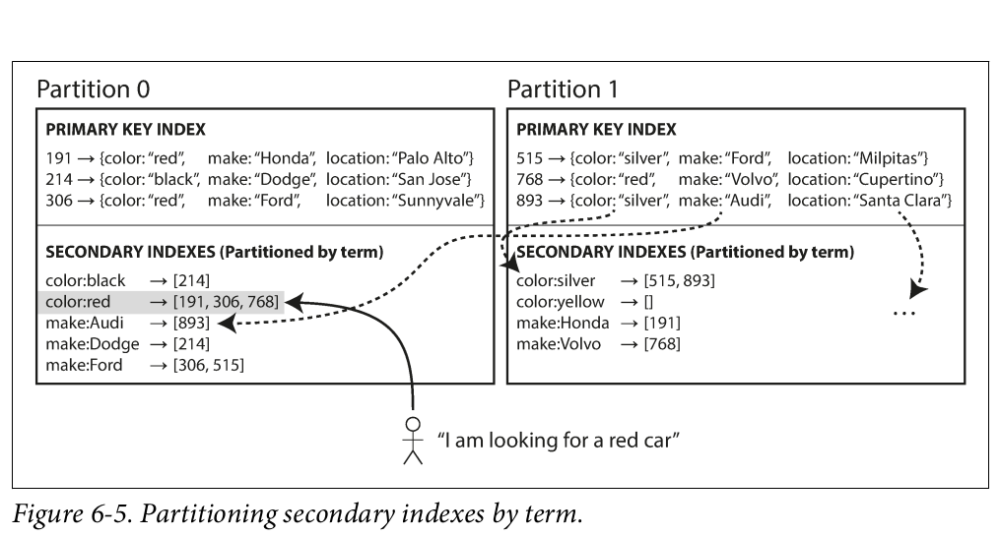

# Partitioning

### **1. Introduction to Partitioning**

- **Purpose**:
    - Partitioning (or sharding) splits large datasets into smaller subsets to improve scalability.
    - Enables distribution of data and query load across multiple nodes in a shared-nothing cluster.
- **Terminology**:
    - Called *shards* (MongoDB,Elasticsearch), *regions* (HBase), *tablets* (Bigtable), *vnodes* (Cassandra/Riak), or *vBuckets* (Couchbase).

### **2. Partitioning and Replication**

- **Combination**:
    - Partitioning is often used with replication for fault tolerance.
    - Each partition may have multiple copies across nodes (leader-follower model).
- **Independence**:
    - Partitioning schemes are separate from replication strategies.

### **3. Partitioning Strategies for Key-Value Data**

- **Goal**: Distribute data and queries evenly to avoid *skew* (uneven load) and *hot spots* (overloaded partitions).

### **a. Partitioning by Key Range**

- **Method**: Assign contiguous ranges of keys to partitions (e.g., encyclopedia volumes A–B, C–D).
- **Advantages**:
    - Supports efficient range queries (e.g., timestamps, alphabetical ranges).
    - Keys can be kept sorted within partitions.
- **Disadvantages**:
    - Risk of hot spots if access patterns are uneven (e.g., all writes to a "current day" partition).
    - Requires manual or dynamic boundary adjustments to balance data distribution.
- **Examples**: HBase, Bigtable, MongoDB (pre-v2.4).

### **b. Partitioning by Hash of Key**

- **Method**: Use a hash function to map keys to partitions (e.g., MD5, Fowler-Noll-Vo).
- **Advantages**:
    - Distributes keys uniformly, reducing skew and hot spots.
    - Pseudorandom partition boundaries (consistent hashing-like).
- **Disadvantages**:
    - Loses sort order, making range queries inefficient (must query all partitions).
- **Examples**: Cassandra, MongoDB (hash-based sharding), Voldemort.
- **Hybrid Approach (Cassandra)**:
    - Compound primary key: First part hashed for partitioning, rest used for sorting within partitions.
    
    
    

### **4. Handling Skewed Workloads**

- **Hot Spot Mitigation**:
    - Hashing alone cannot prevent hot spots for frequently accessed keys (e.g., celebrity user IDs).
    - **Solution**: Add a random suffix/prefix to hot keys (e.g., `userID_00` to `userID_99`).
        - Trade-off: Reads must combine data from multiple splits.
        - Requires application-level tracking of split keys.
- **Future**: Systems may automate skew detection and rebalancing.

### **5. Key Takeaways**

- **Key-Range Partitioning**: Best for range queries but prone to skew.
- **Hash Partitioning**: Balances load but sacrifices range query efficiency.
- **Hybrids**: Combine both strategies (e.g., Cassandra’s compound keys).
- **Hot Spots**: Require application-level intervention (e.g., key salting).

## **Partitioning and Secondary Indexes**

### **1. The Challenge of Secondary Indexes in Partitioned Databases**

- Secondary indexes don't map cleanly to partitions because they don't uniquely identify records (unlike primary keys).
- Common in relational/document databases but historically avoided in key-value stores due to complexity (though some like Riak now support them).
- Essential for search engines like Elasticsearch/Solr.

### **2. Two Approaches to Partition Secondary Indexes**

### **A. Document-Partitioned Indexes (Local Indexes)**

- **How it works**:
    - Each partition maintains its own secondary indexes covering only its own documents.
    - Example: Used car database partitioned by `car_id`, with separate indexes for `color` and `make` in each partition.
- **Write behavior**:
    - Writes only affect the partition where the document lives (e.g., adding a red car updates only its partition's `color:red` index).
- **Read behavior**:
    - Queries must **scatter/gather** across all partitions (e.g., "find all red cars" queries every partition and combines results).
    - Can cause high latency (tail latency amplification).
- **Used by**: MongoDB, Cassandra, Elasticsearch, Riak, VoltDB.
- **Limitation**:
    - Multi-index queries (e.g., "red Fords") often can't be optimized to a single partition.

### **B. Term-Partitioned Indexes (Global Indexes)**

- **How it works**:
    - A global index is partitioned by the indexed term itself (e.g., `color:red` lives on one partition, `color:blue` on another).
    - Term partitioning can be by value ranges (for scans) or hashed (for even distribution).
- **Read behavior**:
    - More efficient: Clients query just the partition holding the term (no scatter/gather).
- **Write behavior**:
    - Slower/complex: A single document update may touch multiple index partitions (e.g., updating a car's `color` and `make`).
    - Often implemented asynchronously to avoid distributed transactions.
- **Examples**:
    - DynamoDB global secondary indexes (near-real-time updates).
    - Riak search, Oracle data warehouse.

### **3. Tradeoffs: Local vs. Global Indexes**

| **Aspect** | **Document-Partitioned (Local)** | **Term-Partitioned (Global)** |
| --- | --- | --- |
| **Write Scalability** | Fast (only touches one partition) | Slower (may touch multiple partitions) |
| **Read Scalability** | Scatter/gather is expensive | Direct lookup is efficient |
| **Consistency** | Easier to keep in sync | Often async (eventually consistent) |
| **Use Cases** | Simple writes, tolerate slow reads | Read-heavy workloads |

### **4. Implementation Notes**

- **Document-partitioned indexes**:
    - Best when queries can be constrained to a partition (e.g., by co-locating related data).
- **Term-partitioned indexes**:
    - Require careful tuning of term distribution to avoid hotspots.
    - DynamoDB uses a form of this with its GSIs (Global Secondary Indexes), which trade strict consistency for availability.
- **Hybrid approaches**:
    - Some systems allow mixing both (e.g., Oracle lets you choose per-index).

### **5. Future Considerations**

- **Conflict resolution**: Asynchronous global indexes may return stale data during failures.
- **Advanced techniques**:
    - **Materialized views** (pre-computed query results) can optimize multi-index queries.
    - **Partitioning by query patterns** (e.g., time-series data) may avoid scatter/gather.

## **Rebalancing Partitions**

### **1. Why Rebalancing is Needed**

- **Changes in workload**: Increased query throughput requires more CPU/RAM.
- **Data growth**: Larger datasets need more storage.
- **Node failures**: Other nodes must take over responsibilities.

**Goals of Rebalancing**:

✔ Fairly distribute load (storage, reads, writes).

✔ Maintain availability during rebalancing.

✔ Minimize data movement (reduce network/disk I/O).

### **2. Rebalancing Strategies**

### **A. Fixed Number of Partitions**

- **How it works**:
    - Pre-create many more partitions than nodes (e.g., 1,000 partitions for 10 nodes).
    - Assign multiple partitions per node (~100 partitions/node).
    - Add/remove nodes? Steal/give partitions to balance load.
- **Pros**:
    - Minimal data movement (only reassign partitions, no key changes).
    - Simple to implement (used by **Riak, Elasticsearch, Couchbase**).
- **Cons**:
    - Must choose partition count upfront (too high → overhead; too low → limits scalability).
    - Partition size grows with data, making recovery expensive for large partitions.

### **B. Dynamic Partitioning**

- **How it works**:
    - Partitions split when too large (e.g., HBase’s 10 GB default) or merge when too small.
    - New partitions are assigned to nodes to balance load.
- **Pros**:
    - Adapts to data volume (small datasets = few partitions; large datasets = more partitions).
    - Used by **HBase, MongoDB, RethinkDB**.
- **Cons**:
    - Empty databases start with 1 partition (hotspot risk).
    - Requires **pre-splitting** for known key distributions.

### **C. Partitioning Proportional to Nodes**

- **How it works**:
    - Fixed partitions **per node** (e.g., Cassandra: 256 partitions/node).
    - New nodes split random partitions and take half.
- **Pros**:
    - Stable partition sizes (grow with data, shrink when adding nodes).
    - Aligns with **consistent hashing** (used by **Cassandra, Ketama**).
- **Cons**:
    - Random splits can be unfair (but averages out with many partitions).

### **3. Rebalancing Operations: Automatic vs. Manual**

| **Approach** | **Pros** | **Cons** | **Examples** |
| --- | --- | --- | --- |
| **Fully Automatic** | Low operational effort. | Risk of cascading failures (e.g., overloaded nodes). | Some NoSQL systems. |
| **Semi-Automatic** | Safety checks with admin oversight. | Slower than full automation. | **Couchbase, Riak, Voldemort**. |
| **Manual** | Prevents surprises. | High operational overhead. | Rare in modern systems. |

**Key Tradeoff**:

- **Automation** is convenient but risky (e.g., misinterpreting slow nodes as dead).
- **Human oversight** reduces surprises but slows rebalancing.

### **4. Practical Considerations**

- **Hash mod N is a bad idea**:
    - Changing node count (`N`) forces most keys to move (e.g., `hash(key) mod 10` → `mod 11`).
    - Fixed partitions or dynamic splitting are better.
- **Hardware mismatches**:
    - Assign more partitions to powerful nodes to balance load.
- **Initial setup**:
    - Dynamic systems start with 1 partition (pre-splitting helps).
    - Fixed-partition systems must plan capacity upfront.

### **Summary**

1. **Fixed partitions**: Simple but inflexible (best for predictable workloads).
2. **Dynamic partitions**: Adapts to data growth (best for variable datasets).
3. **Partitions per node**: Balances size and scalability (used by Cassandra).
4. **Rebalancing mode**:
    - Automatic for ease, manual for safety.
    - Semi-automatic (e.g., Riak) is a common middle ground.

**Final Advice**:

- Use **dynamic partitioning** for growing datasets.
- Prefer **semi-automatic rebalancing** to avoid surprises.
- Avoid `hash mod N`—it’s a rebalancing nightmare.

## **Request Routing in Partitioned Databases**

### **1. The Problem: How Clients Find the Right Node**

When data is partitioned across multiple nodes, clients need a way to determine:

- **Which node** is responsible for a given key (e.g., `"foo"`)?
- **How to route requests** as partitions are rebalanced and nodes change?

This is a **service discovery** challenge common to distributed systems.

### **2. Three Routing Approaches**

| **Approach** | **How It Works** | **Pros & Cons** | **Examples** |
| --- | --- | --- | --- |
| **1. Client → Random Node** | - Clients connect to any node (e.g., via round-robin LB).- Non-owner nodes forward requests. | ✅ Simple for clients. ❌ Adds latency (extra hop). | **Cassandra, Riak** (gossip-based). |
| **2. Client → Routing Tier** | - Dedicated proxy (e.g., `mongos`, `moxi`) routes requests to correct nodes. | ✅ Centralized logic.  ❌ Single point of failure if not redundant. | **MongoDB, Couchbase, Kafka**. |
| **3. Client → Direct (Partition-Aware)** | - Clients know partition assignments and connect directly. | ✅ Lowest latency.     ❌ Complex clients; must track changes. | **Custom implementations**. |
|  |  |  |  |

### **3. How Routing Tiers Track Partition Assignments**

To stay updated on partition/node mappings, systems use:

### **A. External Coordination Service (e.g., ZooKeeper)**

- Nodes register themselves in **ZooKeeper**, which maintains the authoritative partition map.
- Routing tiers/clients subscribe to ZooKeeper for updates.
- **Used by**: HBase, SolrCloud, Kafka, LinkedIn’s Espresso (via Helix).

### **B. Gossip Protocol (Decentralized)**

- Nodes gossip cluster state changes (e.g., new nodes, partition moves).
- Any node can route requests correctly.
- **Used by**: **Cassandra, Riak**.

### **C. Manual Configuration**

- **Couchbase** relies on static routing (no auto-rebalancing) + a routing tier (`moxi`).

### **4. Bootstrapping Client Connections**

- **Initial IP Discovery**:
    - **DNS**: For slow-changing node IPs (e.g., routing tier endpoints).
    - **Seed Nodes**: Clients connect to a known list of seed nodes (e.g., Cassandra).

### **5. Key Challenges**

- **Consistency**: All components must agree on partition assignments (or requests fail).
    - Solved via **ZooKeeper** (consensus) or **gossip** (eventual consistency).
- **Latency vs. Complexity**:
    - Direct client routing is fastest but requires clients to handle partition changes.
    - Routing tiers simplify clients but add a hop.

### **Summary**

1. **Routing Strategies**:
    - Random node + forwarding (simple, but extra hops).
    - Dedicated routing tier (centralized, scalable).
    - Partition-aware clients (complex, low-latency).
2. **Partition Mapping**:
    - **ZooKeeper**: Centralized, consistent (HBase, Kafka).
    - **Gossip**: Decentralized, eventual consistency (Cassandra).
3. **Practical Tradeoffs**:
    - Use **ZooKeeper** for strong consistency.
    - Use **gossip** for simplicity and fault tolerance.
    - **Hybrid** approaches (e.g., Couchbase) reduce automation but improve stability.

**Final Tip**:

- For most systems, a **routing tier** (e.g., `mongos`) offers the best balance of simplicity and performance.
- Avoid direct client routing unless you need ultra-low latency and can handle complexity.

## **Parallel Query Execution in Distributed Databases**

### **1. Beyond Simple Key-Based Queries**

Most NoSQL databases support only simple operations:

- **Point reads/writes** (fetch/update by key).
- **Scatter/gather** for document-partitioned secondary indexes.

**MPP (Massively Parallel Processing) databases** (e.g., data warehouses) handle complex queries:

✔ Joins, filtering, grouping, aggregations.

✔ Optimized for **analytical workloads** (OLAP).

### **2. How MPP Databases Execute Queries in Parallel**

### **A. Query Optimization & Partitioning**

1. **Query Planning**:
    - The optimizer breaks a query into **stages** (e.g., scan → filter → join → aggregate).
    - Stages are split into **tasks** that run in parallel across nodes.
2. **Data Partitioning**:
    - Tables are partitioned (e.g., by range or hash) and distributed.
    - Each node processes its local data partition.

### **B. Parallel Execution**

- **Scans**: Each node scans its partition concurrently.
- **Joins**:
    - **Co-located joins**: Matching partitions are processed on the same node.
    - **Shuffle joins**: Data is redistributed by join key.
- **Aggregations**:
    - Partial aggregations run per node, then merged globally.

### **C. Fault Tolerance**

- **Checkpointing**: Save intermediate results to recover from failures.
- **Speculative execution**: Restart slow tasks on other nodes.

### **3. Why Parallel Execution Matters**

- **Performance**:
    - Scans over TBs of data finish **orders of magnitude faster**.
    - Example: A 1 TB query might take minutes vs. hours with single-node execution.
- **Scalability**:
    - Add nodes to handle larger datasets/complex queries.

### **4. Comparison: NoSQL vs. MPP**

| **Feature** | **NoSQL (e.g., Cassandra, MongoDB)** | **MPP (e.g., Snowflake, Redshift)** |
| --- | --- | --- |
| **Query Complexity** | Simple (key-based, scatter/gather). | Complex (joins, aggregations, subqueries). |
| **Execution Model** | Single-node or simple parallel scans. | Multi-stage, partitioned execution. |
| **Use Case** | OLTP (low-latency reads/writes). | OLAP (analytics, batch processing). |

### **5. Challenges**

- **Skew**: Uneven data distribution can bottleneck parallel tasks.
    - Fix: Dynamic repartitioning or salting.
- **Network Overhead**: Shuffling data between nodes is expensive.
    - Fix: Optimize partitioning (e.g., by join keys).
- **Cost**: MPP systems require significant resources.

### **Key Takeaways**

1. **MPP databases** excel at parallelizing complex analytical queries.
2. **Stages & Tasks**:
    - Break queries into parallelizable units.
    - Leverage data partitioning for locality.
3. **NoSQL** trades query flexibility for scalability in simple operations.

**For deeper dives**:

- See **Chapter 10** for parallel execution techniques.
- Explore **vectorized execution** (Snowflake) and **columnar storage** (Redshift).

**Final Tip**:

- Use **MPP** for analytics, **NoSQL** for transactional workloads.
- Hybrid systems (e.g., **Google BigQuery**) blur the lines.

## **Summary: Partitioning in Distributed Databases**

### **1. Why Partitioning is Necessary**

- **Scalability**: Single machines can't handle massive datasets.
- **Load Balancing**: Distributes data and queries evenly to avoid **hotspots**.

### **2. Partitioning Strategies**

| **Approach** | **How It Works** | **Pros** | **Cons** |
| --- | --- | --- | --- |
| **Key Range Partitioning** | - Keys are sorted (e.g., `A`-`M` on Partition 1, `N`-`Z` on Partition 2).- Partitions split dynamically when they grow too large. | ✔ Efficient range queries.✔ Natural for ordered data. | ❌ Risk of hotspots (e.g., sequential writes). |
| **Hash Partitioning** | - Hash function maps keys to partitions (e.g., `hash(key) mod N`).- Fixed or dynamic partitions. | ✔ Even data distribution.✔ Predictable performance. | ❌ Range queries require scatter/gather. |
| **Hybrid Approaches** | - Combine both (e.g., partition by hash, then sort by timestamp). | ✔ Balances even distribution and query efficiency. | ❌ Increased complexity. |

### **3. Secondary Index Partitioning**

| **Type** | **How It Works** | **Pros** | **Cons** |
| --- | --- | --- | --- |
| **Document-Partitioned (Local)** | Secondary indexes are stored with primary data in each partition. | ✔ Fast writes (single partition). | ❌ Slow reads (scatter/gather). |
| **Term-Partitioned (Global)** | Secondary indexes are split by term (e.g., `color:red` lives on one partition). | ✔ Fast reads (single partition lookup). | ❌ Slow writes (multiple index updates). |

### **4. Rebalancing & Routing**

- **Rebalancing**:
    - **Fixed partitions**: Reassign partitions to nodes (e.g., Riak, Elasticsearch).
    - **Dynamic partitioning**: Split/merge partitions as data grows (e.g., HBase).
    - **Partitions per node**: Scale partitions with cluster size (e.g., Cassandra).
- **Request Routing**:
    - **Random node + forwarding**: Simple but adds latency (Cassandra).
    - **Routing tier**: Centralized proxy (e.g., MongoDB’s `mongos`).
    - **Client-direct**: Complex but low-latency (requires partition awareness).

### **5. Challenges & Tradeoffs**

- **Consistency**: Cross-partition operations risk partial failures (e.g., write to Partition 1 succeeds, Partition 2 fails).
- **Performance**:
    - **Key-range partitioning**: Fast ranges but uneven load.
    - **Hash partitioning**: Even load but slow ranges.
- **Complexity**: Hybrid approaches and global indexes add operational overhead.

### **Key Takeaways**

1. **Choose partitioning based on access patterns**:
    - Use **key-range** for range queries (e.g., time-series data).
    - Use **hash** for uniform load (e.g., user profiles).
2. **Secondary indexes**:
    - **Local indexes** favor write-heavy workloads.
    - **Global indexes** favor read-heavy workloads.
3. **Rebalancing**:
    - Prefer **dynamic partitioning** for growing datasets.
    - Use **fixed partitions** for predictable performance.
4. **Routing**:
    - **Routing tiers** balance simplicity and efficiency.

**What’s Next?**

- Cross-partition operations require **transactions** (Chapter 7).
- **Consensus protocols** ensure agreement during rebalancing (Chapter 9).

**Final Advice**:

- Start simple (hash partitioning + local indexes).
- Optimize for your dominant workload (reads vs. writes).
- Monitor hotspots and adjust partitioning as needed.
