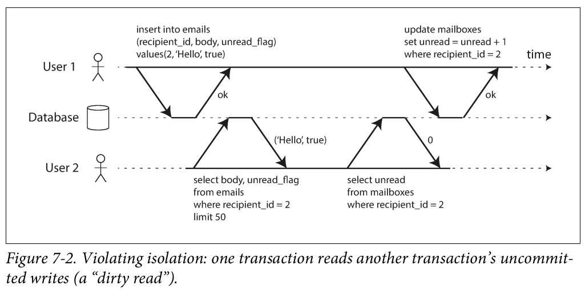
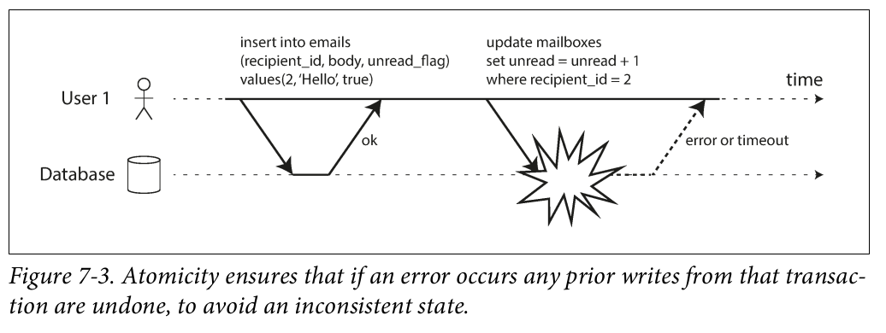
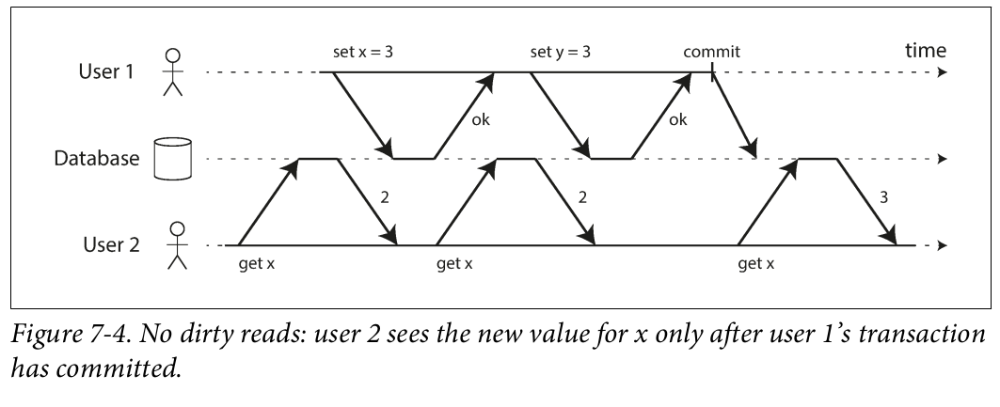

# Transactions

## Introduction

### **1. Challenges in Data Systems**

- **Potential failures:**
    - Hardware/software crashes (mid-operation).
    - Application crashes (during a series of operations).
    - Network interruptions (disconnecting clients or nodes).
    - Concurrent write conflicts (overwriting data).
    - Partial reads (inconsistent/incomplete data).
    - Race conditions (unpredictable bugs).

### **2. Role of Transactions**

- **Definition:** Group multiple reads/writes into a single logical unit.
- **Guarantees:**
    - **Atomicity:** Entire transaction succeeds (*commit*) or fails (*abort/rollback*).
    - **Simplified error handling:** No partial failures—applications can safely retry.
- **Purpose:**
    - Abstracts complexity, letting databases handle concurrency and errors.
    - Not "natural" but a tool to simplify application logic.

### **3. Trade-offs of Transactions**

- **Not always needed:** Some systems prioritize performance/availability over guarantees.
- **Costs:** Overhead in implementation and runtime.
- **Alternatives:** Weaker guarantees or non-transactional approaches may suffice.

### **4. Scope of the Chapter**

- **Focus areas:**
    - Failure scenarios and database safeguards.
    - **Concurrency control:** Race conditions and isolation levels (read committed, snapshot isolation, serializability).
- **Applicability:** Covers both single-node and distributed databases (distributed challenges addressed later).

### **Key Takeaways**

1. Transactions provide safety by bundling operations atomically.
2. They shift error/concurrency handling from apps to databases.
3. Not mandatory—trade-offs exist between guarantees and performance.
4. Upcoming sections dive into isolation levels and failure resilience.

## The Slippery Concept of a Transaction

### **a. Historical Context of Transactions**

- **Origins:**
    - Introduced in 1975 by IBM System R (first SQL database).
    - Core design remains largely unchanged in modern relational DBs (MySQL, PostgreSQL, Oracle, etc.).
- **NoSQL Movement (Late 2000s):**
    - Prioritized scalability, replication, and partitioning.
    - Often weakened or abandoned transactions to achieve these goals.

### **b. Misconceptions About Transactions**

- **Myth 1:** Transactions inherently oppose scalability.
    - Some NoSQL systems claimed large-scale systems must discard transactions for performance/availability.
- **Myth 2:** Transactions are mandatory for "serious applications."
    - Vendor hype sometimes overstates their necessity.
- **Reality:** Transactions involve **trade-offs**, not absolutes.

### The Meaning of Acid

**1. ACID Overview**

- **Origins:** Coined in 1983 to standardize fault-tolerance terminology.
- **Reality:** Implementation varies across databases; "ACID compliance" is often vague/marketing-driven.
- **BASE Alternative ("Not ACID"):**
    - Stands for *Basically Available, Soft state, Eventual consistency*.
    - Even less precise than ACID.

**2. Breakdown of ACID Properties**

**Atomicity**

- **Definition:** Ensures a transaction is treated as a single, indivisible unit.
- **Key Idea:**
    - On failure, all partial writes are *aborted* (rolled back).
    - Prevents "half-finished" states (e.g., crashes mid-operation).
- **Misnomer:** "Abortability" would be more accurate.

**Consistency (the Tricky One)**

- **Overloaded Term:** Used differently in replication, hashing, CAP theorem, and ACID.
- **ACID Context:**
    - Application-specific invariants (e.g., "account balances must sum to zero").
    - **Database Role:** Provides tools (atomicity/isolation) to help apps enforce invariants.
    - **Not a Database Guarantee:** Apps must define valid states (e.g., via constraints).

**Isolation**

- **Goal:** Prevent race conditions between concurrent transactions (e.g., lost updates).
- **Ideal:** *Serializability* (transactions appear to run one at a time).
- **Reality:**
    - Serializable isolation is rare due to performance costs.
    - Weaker levels (e.g., *snapshot isolation*) are often used instead.

**Durability**

- **Promise:** Committed data survives crashes.
- **Implementation Challenges:**
    - Single-node: Writes to disk (via write-ahead logs, etc.).
    - Distributed: Replication + disk writes.
- **No Perfect Solution:** Risks include disk corruption, SSD failures, and replication lag.

**3. Durability Trade-offs (Replication vs. Disk)**

- **Disk Writes:**
    - Protects against node failures but may leave data temporarily inaccessible.
    - Vulnerable to hardware corruption (e.g., bad blocks, firmware bugs).
- **Replication:**
    - Improves availability but can lose recent writes if async.
    - Fails under correlated faults (e.g., network outages).
- **Best Practice:** Combine disk writes, replication, *and* backups.

**4. Key Takeaways**

1. **Atomicity:** Ensures "all or nothing" execution.
2. **Consistency:** Apps define rules; DB provides tools.
3. **Isolation:** Concurrency control (serializability is ideal but costly).
4. **Durability:** Requires multiple strategies (disk + replication + backups).
5. **No Silver Bullet:** All guarantees involve trade-offs.

### Single-Object and Multi-Object Operations

**1. Core ACID Properties in Multi-Object Context**

- **Atomicity:**
    - Ensures *all* writes in a transaction succeed or *none* do (rollback on failure).
    - Prevents partial updates (e.g., email saved but unread counter not incremented).
- **Isolation:**
    - Concurrent transactions appear sequential; no "intermediate states" visible.
    - Example: A user sees *both* a new email *and* updated counter, or neither.
    

**2. Single-Object Writes**

- **Basic Guarantees:**
    - Even single-object writes need atomicity/isolation (e.g., no partial JSON fragments).
    - Implemented via write-ahead logs (atomicity) and locks (isolation).
- **Lightweight Operations:**
    - `increment` or `compare-and-set` avoid read-modify-write cycles but are *not* full transactions.
    - Marketing terms like "lightweight transactions" can be misleading.

**3. Why Multi-Object Transactions Matter**

- **Use Cases Requiring Coordination:**
    - **Relational DBs:** Foreign key validity across tables.
    - **Document DBs:** Denormalized data sync (e.g., email + counter in Figure 7-2).
    - **Secondary Indexes:** Atomic updates to indexes and primary data.
- **Without Transactions:**
    - Apps must handle errors/concurrency manually → complex and error-prone.

**4. Challenges & Trade-offs**

- **Distributed Systems:**
    - Multi-object transactions are harder across partitions (see Chapter 9).
    - Some NoSQL systems sacrifice them for scalability/availability.
- **Error Handling:**
    - **Retry Logic:** Safe for transient errors (deadlocks, network issues) but risks:
        - Duplicate commits (if commit acknowledgment fails).
        - Overload amplification (if retrying under heavy load).
    - **Permanent Errors:** Retries are useless (e.g., constraint violations).
    - **Side Effects:** Non-database actions (e.g., sending emails) complicate rollbacks.

**5. Key Takeaways**

1. **Single-object atomicity ≠ transactions:** Full transactions group *cross-object* operations.
2. **Multi-object needs:** Foreign keys, denormalized data, and indexes often require transactions.
3. **Retries ≠ Perfect:** Idempotency, overload, and external side effects must be handled carefully.
4. **Distributed trade-offs:** Transactions *can* work in distributed DBs but add complexity.

## Weak Isolation Levels

- **The Challenge of Concurrency**
    - **Race Conditions:** Occur when:
        - One transaction reads data being modified by another.
        - Two transactions try to modify the same data simultaneously.
    - **Why It’s Hard:**
        - Bugs are timing-dependent and hard to reproduce.
        - Difficult to reason about in large applications with many users.
        
- **Isolation Levels: Theory vs. Reality**
    - **Ideal (Serializable Isolation):**
        - Transactions appear to run one at a time (no concurrency issues).
        - **Problem:** High performance cost → rarely used in practice.
    - **Reality:** Most databases use *weaker isolation levels*, trading safety for speed.
        - Leads to subtle bugs (e.g., financial losses, data corruption).
        
- **Why Weak Isolation Persists**
    - **Misconception:** “ACID databases prevent all concurrency bugs.”
        - Even “ACID” databases often default to weak isolation (not serializable).
    - **Solution:** Developers must understand isolation levels to avoid pitfalls.
- **Key Takeaways**
    1. **Concurrency is tricky:** Isolation levels hide complexity but aren’t foolproof.
    2. **Serializable is rare:** Performance trade-offs lead to weaker defaults.
    3. **Know your isolation level:** Weak isolation can still cause bugs (even in “ACID” systems).
    4. **Up next:** Detailed breakdown of specific weak isolation levels and their risks.

### **Read Committed Isolation Level**

**1. Definition & Guarantees**

**Read Committed** is the most basic isolation level, providing:

1. **No Dirty Reads:**
    - Only see *committed* data (never uncommitted changes from other transactions).
    - Example: User 2 reads `x=2` while User 1’s uncommitted write (`x=3`) is invisible.
    
    
    
2. **No Dirty Writes:**
    - Cannot overwrite uncommitted data from another transaction.
    - Example: Concurrent car buyers can’t partially overwrite each other’s updates.
    
    
    
**2. Why Prevent Dirty Reads?**

- **Partial Updates:** Avoid exposing inconsistent state (e.g., new email visible but counter not updated).
- **Rollbacks:** Prevents transactions from seeing data that later disappears (due to aborts).

**3. Why Prevent Dirty Writes?**

- **Conflicting Updates:** Ensures transactions fully complete before others can modify the same data.
- **Real-World Example:**
    - Car sale awarded to Bob (listing updated) but invoice sent to Alice (dirty write without locks).
- **Limitation:** Does *not* prevent lost updates (e.g., concurrent counter increments).

**4. Implementation**

- **For Dirty Writes:**
    - **Row-level locks:** Transactions acquire locks on modified rows until commit/abort.
    - Blocks other writers (but not readers).
- **For Dirty Reads:**
    - **No read locks** (to avoid delaying read-only transactions).
    - Instead, databases store:
        - **Old committed value** (for ongoing transactions to read).
        - **New uncommitted value** (hidden until commit).

**5. Key Takeaways**

1. **Default in Many DBs:** PostgreSQL, Oracle, SQL Server, etc.
2. **Locks for Writes, No Locks for Reads:** Balances safety and performance.
3. **Weak Against:**
    - Lost updates.
    - Non-repeatable reads (a transaction may see different values if re-reading).

### **Implementing Snapshot Isolation**

**1. Core Principle**

- **Snapshot Isolation** provides a transaction with a consistent view of the database *as of its start time*.
- **Key Benefit:**
    - *Readers never block writers, writers never block readers* → high concurrency.

**2. Multi-Version Concurrency Control (MVCC)**

- **How It Works:**
    - Maintains *multiple versions* of each object (rows/documents).
    - Each version tagged with:
        - `created_by`: Transaction ID that created it.
        - `deleted_by`: Transaction ID that marked it for deletion (if applicable).
- **Example (PostgreSQL):**
    - Transaction 13 updates account balance from 500→500→400:
        - Original row ($500) marked `deleted_by=13`.
        - New row ($400) added with `created_by=13`.

**3. Transaction Visibility Rules**

- A transaction sees:
    - All rows where `created_by ≤ current_txid` AND (`deleted_by` is NULL OR `deleted_by > current_txid`).
    - Ignores rows created by transactions that started *after* it.

**4. Garbage Collection**

- **Cleanup:** Removes rows marked for deletion once no active transactions can access them.
- **Optimization:** Prevents database bloat from outdated versions.

**5. Read Committed vs. Snapshot Isolation**

| **Aspect** | **Read Committed** | **Snapshot Isolation** |
| --- | --- | --- |
| **Snapshot Scope** | Per *query* | Per *transaction* |
| **Write Conflicts** | Prevents dirty writes (locks) | Prevents dirty writes (locks) |
| **Read Consistency** | Sees latest committed data | Sees fixed snapshot in time |

### **6. Key Takeaways**

1. **MVCC Enables Snapshots:** Tracks object versions to avoid locking readers.
2. **Performance Advantage:** Writers and readers operate concurrently without blocking.
3. **Implementation Details:**
    - Transaction IDs (`txid`) tag all changes.
    - Updates = Delete + Create (preserves history).
